# The Mood Desing Gift Shop

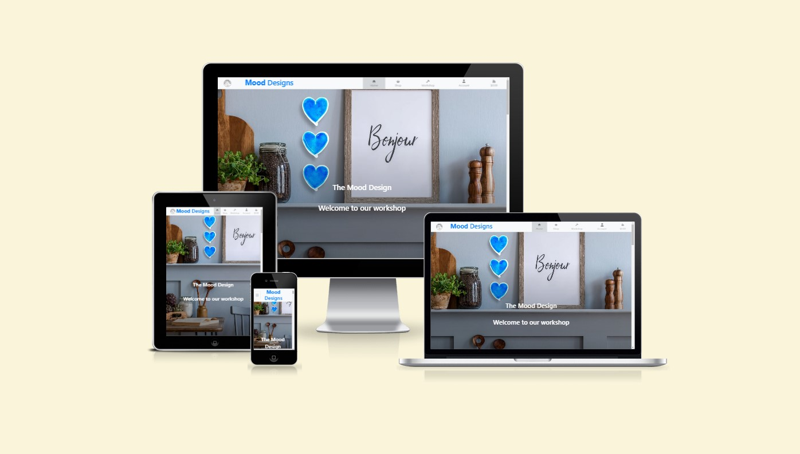

## 1. Overview.

The subject of the project is e-commerce web page application dedicated to Mood Designs Gift Shop that designs and produces handmade, ceramic goods inspired by West Irish folk art and rich natural values of West Ireland the route Wild Atlantic Way. 

The purpose of the application is providing user easy way to present the shops offer and to inform users about new products, offers and news about the Mood Designs team and events taking place within its society. The informations can be easily find on the Home Page or they can be sent do user email in form of Newsletter.

The application allowes users to search Mood Designs products, to buy them and to make secured on-line payments using Credit or Debit cards.
It also allows users to create their profile account to save and store theirs shipping and payment details as well as store theirs orders history.


## Contents:
1. [Project Overview](#1-overview)
2. [User Stories](#2-user-stories)
3. [Features](#3-features)
    * [Home Page](#home-page)
    * [Navigation Bar](#navigation-bar)
    * [Posts](#post)
    * [Footer](#footer)
    * [Shop Page]()
    * [Workshop Page]()
    * [Account Page]()
    * [Register, Login/logout]()
    * [Basket Page]()
    * [Checkout Page]()
4. [Future Features](#4-future-features)
5. [Technologies Used](#5-technologies-used)
6. [Database Design](#6-database-design)
7. [Deploymanet](#7-deployment)
8. [Testing](#8-testing)


8. [References and Credits](#references-and-credits)


## **2. User Stories:**

### New Site Users

- As a new site user, I would like to  see a userfriendly home page, so that I can easily find interesting content and sections in the Page.
- As a new site user, I would like to Create an account where I can store my personal data so that I don't have to fill up the personal data forms each time I buy something..
- As a new site user, I would like to see contact details so that I can find more information about the shop owners.
- As a new site user, I would like to add items to a shopping Basket, so that I can reserve an item and continue shopping.
- As a new site user, I would like to Delete products from my shopping basket.
- As a new site user, I would like to display the shopping basket so that I can see all reserved items.
- As a new site user, I would like to display single item detail page so that I can get more information about the product.
- As a new site user, I would like to display the Page on mobile devices so I can buy items on a mobile phone.
- As a new site user, I would like to use mobile side bar, so that I can use the application on small size devices.
- As a new site user, I would like to, after adding all items to the shopping basket, to be redirected to the Payment Page so I can finalize the shopping and make a payment.
- As a new site user, I would like to save my personal details needed for making payments, so that I can use them during my next shoppings.
### Returning Site Users

- As a returning site user, I would like to log in/out so that I can use the sites personalized functionalities as well as store and protect my personal data.
- As a returning site user, I would like to sign up to a newsletter to keep up to date with deals and events
- As a returning site user, I would like to Edit my account details so that my profile is up to date.
- As a returning site user, I would like to delete my account so that I can remove my account if I no longer use it.
- As a returning site user, I would like to see if I am logged in or not.
- As a returning site user, I would like to informed by email about actions taken place in the page, so that my account is better secured.
- As a returning site user, I would like to publish my feedback in the page, so that I can share my experience with other users
- As a returning site user, I would like to  Log in with Social media so that I can use my already existing account.
- As a returning site user, I would like to see my previous orders list and payment history .

### Site Admin

- As a site administrator, I should be able to create a superuser account so that I can get access to function only available for sellers.
- As a site administrator, I should be able to add new items to the database, so that I can add new items for sale and save then in the database
- As a site administrator, I should be able to Edit itemsfor sale and save changes to the database
- As a site administrator, I should be able to Delete items from the database, so that They can not be available on sale any more.

## **4. Features. **

### Home Page
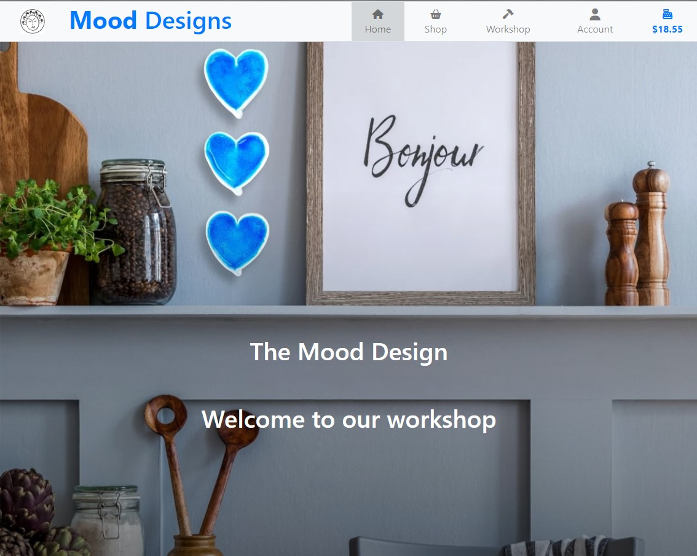

### Navigation Bar

All sections are clearly and simply arranged inside the navigation bar which allows for an easy access to applications section depending on whether the user is logged in or not.

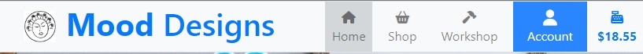

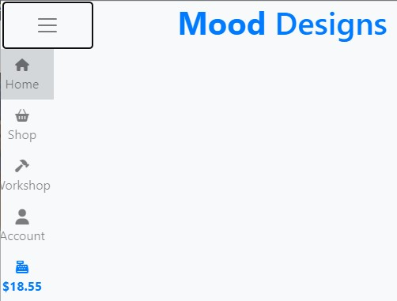

### Post 
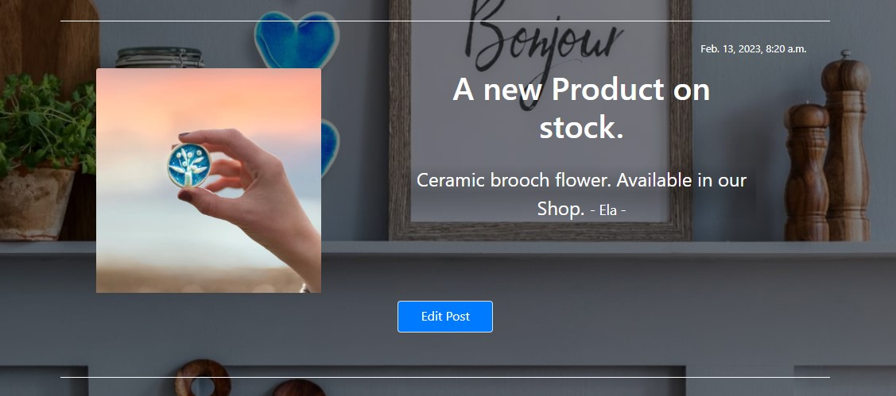

### Footer 
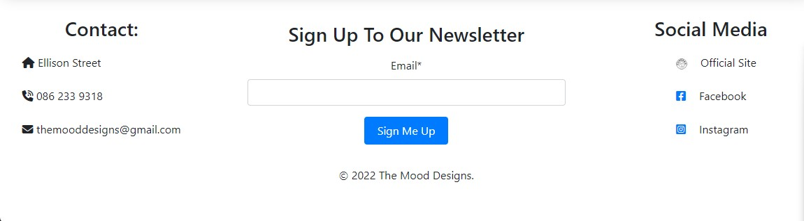

### Shop Page

Shop Page displays the list of products available in the Shop

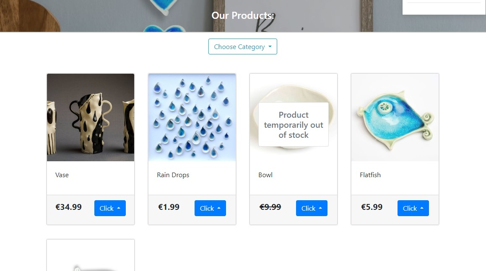

Each product panel contains a dropdown option button which allows the user to open the products detail page or to add the product to his shopping basket.

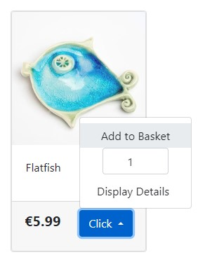

In case of an out os stock product Add To Basket button is not available.

### Product Details Page

This section displays more information about the product. SUch as product description quantity of the product on Stock and the Price.

It also allows to choose the number of products and add them to the Shopping Basket.

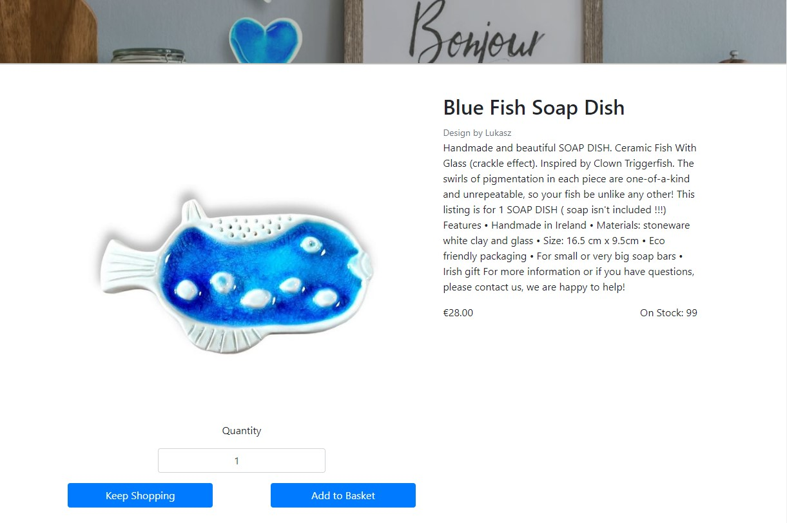

Out of Stock products are not able to be added to the SHopping Basket.


### Workshop Page


### Account Page
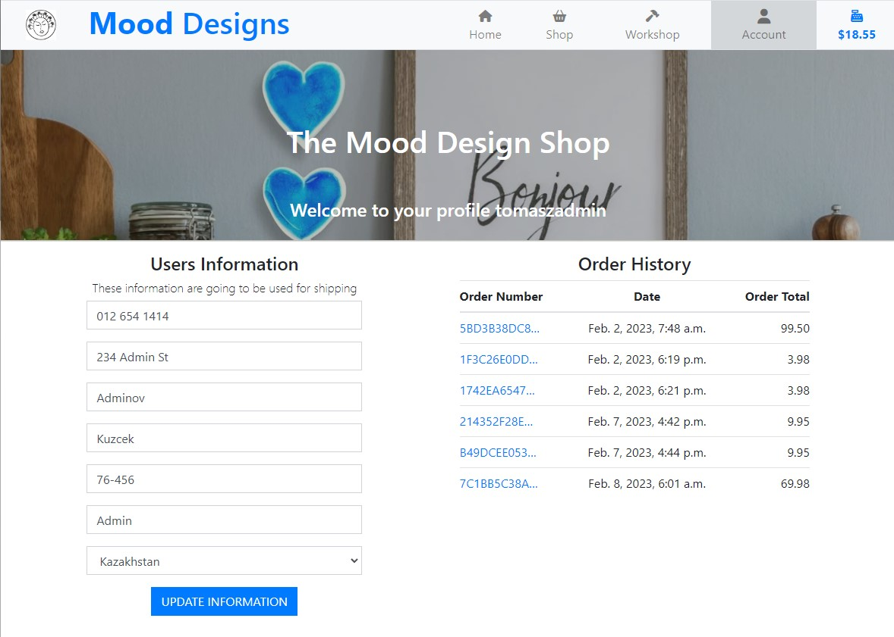

### Register, login/logout Pages


### Checkout


## **5. Technologies used:**

* Python - an interpreted, object-oriented, high-level programming language https://www.python.org/.
* Django - Framework facilitating building full stack web application https://www.djangoproject.com/.
* Django allauth - an authentication module that allows account authentication, registration and management https://django-allauth.readthedocs.io/en/latest/.
* Bootstrap - Powerful, extensible, and feature-packed frontend framework that allows buiding fast and responsive websites: https://getbootstrap.com/.
* Javascript - High-level programming language https://www.javascript.com/.
* HTML5 - Markup language used to make webpages https://html.com/html5/.
* CSS3 - A language used to style HTML and XHTML documents presentations in web development.
* Gitpod - Online integrated development environment https://www.gitpod.io/.
* GitHub - Version control service used for storing and sharing development projects https://github.com/.
* Heroku - a container-based cloud platform where developers can deploy their projects https://www.heroku.com/.
* Amazon Web Services s3 - a cloud-based stporage service.
* Stripe - a suite of APIs powering online payment processing and commerce solutions for internet businesses.


## **6. Database Design**

The Project contains following classes to describe categories of products, Products features and also classes to describe application users profiles.

```python
class Category(models.Model):

    name = models.CharField(max_length=254)
    friendly_name = models.CharField(max_length=254, null=True, blank=True)
```

```python
class Product(models.Model):
 DESIGNERS = [
        ('Ela', 'Ela'),
        ('Lukasz', 'Lukasz')
    ]
    category = models.ForeignKey('Category', null=True, blank=True, on_delete=models.SET_NULL)
    created_on = models.DateField(default=timezone.now)
    designer = models.CharField(choices=DESIGNERS, max_length=10, default='Ela')
    name = models.CharField(max_length=254)
    quantity = models.IntegerField(default=0)
    description = models.TextField()
    price = models.DecimalField(max_digits=6, decimal_places=2)
    image = models.ImageField(null=True, blank=True)

    def __str__(self):
        return self.name
```

```python
class UserProfile(models.Model):

    user = models.OneToOneField(User, on_delete=models.CASCADE)
    default_phone_number = models.CharField(max_length=20, null=False, blank=False)
    default_street_address1 = models.CharField(max_length=80, null=False, blank=False)
    default_street_address2 = models.CharField(max_length=80, null=True, blank=True)
    default_town_or_city = models.CharField(max_length=40, null=False, blank=False)
    default_postcode = models.CharField(max_length=20, null=True, blank=True)
    default_county = models.CharField(max_length=80, null=True, blank=True)
    default_country = CountryField(blank_label='Country *', null=False, blank=False)
```

```python
def create_or_update_user_profile(sender, instance, created, **kwargs):

    if created:
        UserProfile.objects.create(user=instance)

    instance.userprofile.save()
```

```python
class Order(models.Model):
    order_number = models.CharField(max_length=32, null=False, editable=False)
    user_profile = models.ForeignKey(UserProfile, on_delete=models.SET_NULL,
                                     null=True, blank=True, related_name='orders')
    full_name = models.CharField(max_length=50, null=False, blank=False)
    email = models.EmailField(max_length=254, null=False, blank=False)
    phone_number = models.CharField(max_length=20, null=False, blank=False)
    country = CountryField(blank_label='Country *', null=False, blank=False)
    postcode = models.CharField(max_length=20, null=True, blank=True)
    town_or_city = models.CharField(max_length=40, null=False, blank=False)
    street_address1 = models.CharField(max_length=80, null=False, blank=False)
    street_address2 = models.CharField(max_length=80, null=True, blank=True)
    county = models.CharField(max_length=80, null=True, blank=True)
    date = models.DateTimeField(auto_now_add=True)
    delivery_cost = models.DecimalField(max_digits=6, decimal_places=2, null=False, default=0)
    order_total = models.DecimalField(max_digits=10, decimal_places=2, null=False, default=0)
    grand_total = models.DecimalField(max_digits=10, decimal_places=2, null=False, default=0)
```

```python
class OrderLineItem(models.Model):
    order = models.ForeignKey(Order, null=False, blank=False, on_delete=models.CASCADE, related_name='lineitems')
    product = models.ForeignKey(Product, null=False, blank=False, on_delete=models.CASCADE)
    quantity = models.IntegerField(null=False, blank=False, default=0)
    lineitem_total = models.DecimalField(max_digits=6, decimal_places=2, null=False, blank=False, editable=False)
```

```python 
class NewsletterUser(models.Model):
    email = models.EmailField(max_length=254, null=False, blank=False)
    added_on = models.DateTimeField(auto_now_add=True)
```

```python
class Post(models.Model):
    DESIGNERS = [
        ('Ela', 'Ela'),
        ('Lukasz', 'Lukasz')
    ]

    title = models.TextField()
    designer = models.CharField(choices=DESIGNERS, max_length=10, default='Ela')
    created_on = models.DateTimeField(auto_now_add=True)
    updated_on = models.DateTimeField(auto_now=True)
    body = models.TextField()
    image = models.ImageField(null=True, blank=True)
    email = models.ManyToManyField(NewsletterUser)
```

## ** 7. Deployment **

## ** 8. Testing **

## ** 9. GitHub Issues**

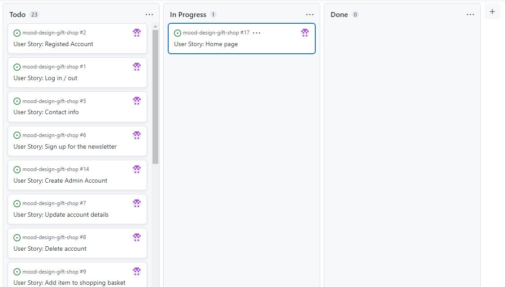

There, I used my own **User Story Template** to manage user stories.

It also helped with milestone iterations on a weekly basis.

Consider adding a screenshot of your Open and Closed Issues.

- [Open Issues](https://github.com/TomaszWoloszyn983/mood-design-gift-shop/issues?q=is%3Aopen+is%3Aissue)

    

- [Closed Issues](https://github.com/TomaszWoloszyn983/mood-design-gift-shop/issues?q=is%3Aissue+is%3Aclosed)

    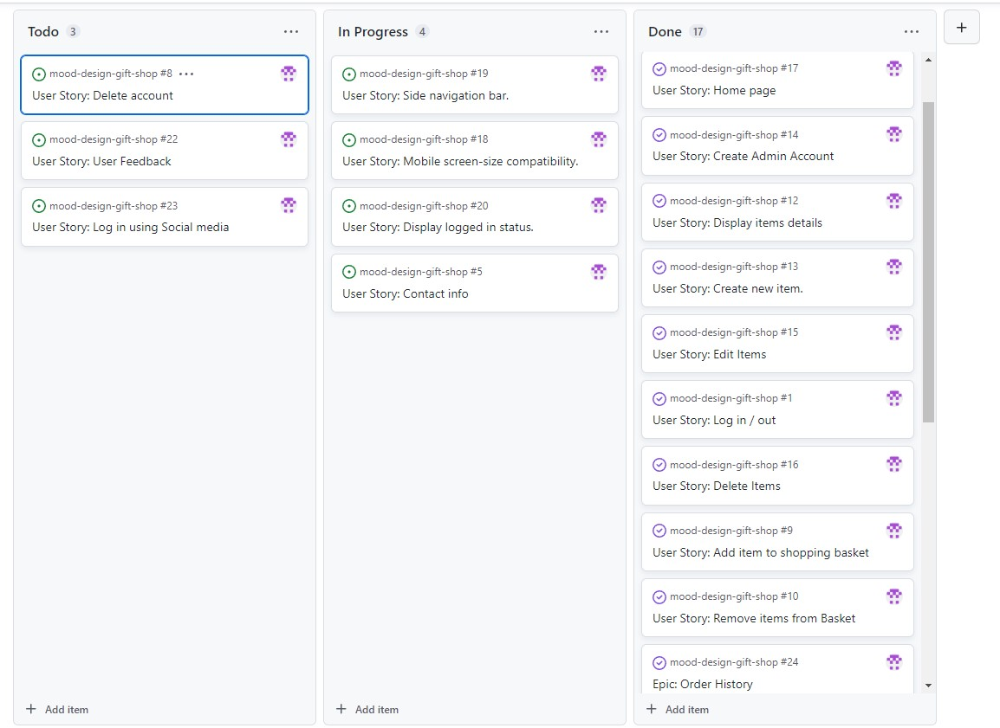

### MoSCoW Prioritization

I've decomposed my Epics into stories prior to prioritizing and implementing them.
Using this approach, I was able to apply the MoSCow prioritization and labels to my user stories within the Issues tab.


- **Must Have**: guaranteed to be delivered (*max 60% of stories*)
- **Should Have**: adds significant value, but not vital (*the rest ~20% of stories*)
- **Could Have**: has small impact if left out (*20% of stories*)
- **Won't Have**: not a priority for this iteration


## References and Credits:
- You Tube video tutorial how to create 3D Parallax landing page effect - https://www.youtube.com/watch?v=Nt70Ld0dJCM

- You Tube tutorial how to choose colors - https://www.youtube.com/watch?v=KMS3VwGh3HY&list=WL&index=102

- You Tube tutorial on sending newsletters - https://www.youtube.com/watch?v=C9rszGfDMYM


## Gitpod Reminders

To run a frontend (HTML, CSS, Javascript only) application in Gitpod, in the terminal, type:

`python3 -m http.server`

A blue button should appear to click: _Make Public_,

Another blue button should appear to click: _Open Browser_.

To run a backend Python file, type `python3 app.py`, if your Python file is named `app.py` of course.

A blue button should appear to click: _Make Public_,

Another blue button should appear to click: _Open Browser_.

In Gitpod you have superuser security privileges by default. Therefore you do not need to use the `sudo` (superuser do) command in the bash terminal in any of the lessons.

To log into the Heroku toolbelt CLI:

1. Log in to your Heroku account and go to *Account Settings* in the menu under your avatar.
2. Scroll down to the *API Key* and click *Reveal*
3. Copy the key
4. In Gitpod, from the terminal, run `heroku_config`
5. Paste in your API key when asked

You can now use the `heroku` CLI program - try running `heroku apps` to confirm it works. This API key is unique and private to you so do not share it. If you accidentally make it public then you can create a new one with _Regenerate API Key_.

------
