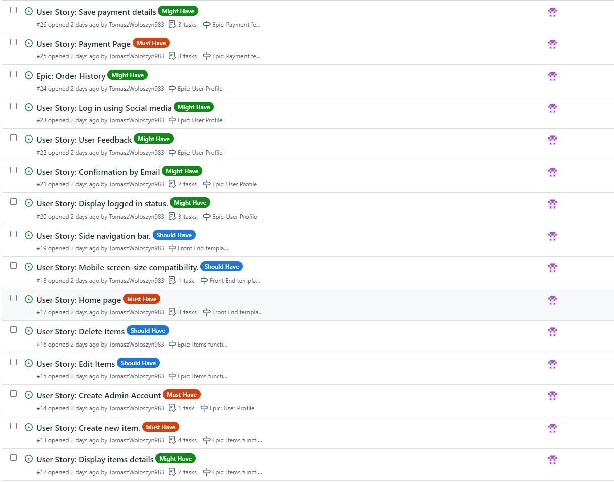

# The Mood Desing Gift Shop

## 1. Overview.

Portfolio Project 4.
The subject of the project is the web shopping list application. 
This is a very simple and easy to use application that offers users a few basic functionalities, such as creating multiple shopping lists managing those lists and adding items to the lists, updating them or deleting them from the lists. 
It also allows the user to register his own account what gives him an access to application functionalities.


## Contents:
1. [Project Overview](#1-overview)
2. [User Stories](#2-user-stories)
5. [Technologies Used](#5-technologies-used)
6. [Database Design](#6-database-design)
7. [Github Issues](#7-github-issues)
<!-- 3. [Features](#3-features)
    * [Home Page](#home-page)
    * [List Page](#lists-page)
    * [Shopping List View](#shopping-list-page)
    * [Add Item](#add-item)
    * [Edit Item](#edit-item)
    * [Register, Login/logout](#register-loginlogout-pages)
    * [List class](#list-class)
    * [Item Class](#item-class)
4. [Future Features](#4-future-features)
6. [Testing](#6-testing)
7. [Deployment](#8-deployment)
8. [References and Credits](#9-references-and-credits) -->


## **2. User Stories:**

### New Site Users

- As a new site user, I would like to  see a userfriendly home page, so that I can easily find interesting content and sections in the Page.
- As a new site user, I would like to Create an account where I can store my personal data so that I don't have to fill up the personal data forms each time I buy something..
- As a new site user, I would like to see contact details so that I can find more information about the shop owners.
- As a new site user, I would like to add items to a shopping Basket, so that I can reserve an item and continue shopping.
- As a new site user, I would like to Delete products from my shopping basket.
- As a new site user, I would like to display the shopping basket so that I can see all reserved items.
- As a new site user, I would like to display single item detail page so that I can get more information about the product.
- As a new site user, I would like to display the Page on mobile devices so I can buy items on a mobile phone.
- As a new site user, I would like to use mobile side bar, so that I can use the application on small size devices.
- As a new site user, I would like to, after adding all items to the shopping basket, to be redirected to the Payment Page so I can finalize the shopping and make a payment.
- As a new site user, I would like to save my personal details needed for making payments, so that I can use them during my next shoppings.
### Returning Site Users

- As a returning site user, I would like to log in/out so that I can use the sites personalized functionalities as well as store and protect my personal data.
- As a returning site user, I would like to sign up to a newsletter to keep up to date with deals and events
- As a returning site user, I would like to Edit my account details so that my profile is up to date.
- As a returning site user, I would like to delete my account so that I can remove my account if I no longer use it.
- As a returning site user, I would like to see if I am logged in or not.
- As a returning site user, I would like to informed by email about actions taken place in the page, so that my account is better secured.
- As a returning site user, I would like to publish my feedback in the page, so that I can share my experience with other users
- As a returning site user, I would like to  Log in with Social media so that I can use my already existing account.
- As a returning site user, I would like to see my previous orders list and payment history .

### Site Admin

- As a site administrator, I should be able to create a superuser account so that I can get access to function only available for sellers.
- As a site administrator, I should be able to add new items to the database, so that I can add new items for sale and save then in the database
- As a site administrator, I should be able to Edit itemsfor sale and save changes to the database
- As a site administrator, I should be able to Delete items from the database, so that They can not be available on sale any more.


## **5. Technologies used:**

* Python - an interpreted, object-oriented, high-level programming language https://www.python.org/.
* Django - Framework facilitating building full stack web application https://www.djangoproject.com/.
* Django allauth - an authentication module that allows account authentication, registration and management https://django-allauth.readthedocs.io/en/latest/.
* Bootstrap - Powerful, extensible, and feature-packed frontend framework that allows buiding fast and responsive websites: https://getbootstrap.com/.
* Javascript - High-level programming language https://www.javascript.com/.
* HTML5 - Markup language used to make webpages https://html.com/html5/.
* CSS3 - A language used to style HTML and XHTML documents presentations in web development.
* Gitpod - Online integrated development environment https://www.gitpod.io/.
* GitHub - Version control service used for storing and sharing development projects https://github.com/.
* Heroku - a container-based cloud platform where developers can deploy their projects https://www.heroku.com/.


## **6. Database Design**

The Project contains following classes to describe categiries of products, Products features and also classes to describe application users profiles.

```python
class Category(models.Model):

    name = models.CharField(max_length=254)
    friendly_name = models.CharField(max_length=254, null=True, blank=True)
```


```python
class Product(models.Model):
    category = models.ForeignKey('Category', null=True, blank=True, on_delete=models.SET_NULL)
    created_on = models.DateField(default=timezone.now)
    name = models.CharField(max_length=254)
    quantity = models.IntegerField(default=0)
    description = models.TextField()
    price = models.DecimalField(max_digits=6, decimal_places=2)
    image = models.ImageField(null=True, blank=True)

    def __str__(self):
        return self.name
```

Consider adding a basic screenshot of your Projects Board.


## **7. GitHub Issues**


There, I used my own **User Story Template** to manage user stories.

It also helped with milestone iterations on a weekly basis.

Consider adding a screenshot of your Open and Closed Issues.

- [Open Issues](https://github.com/TomaszWoloszyn983/boutique-ado-walkthrough-project/issues)

    

- [Closed Issues](https://github.com/TomaszWoloszyn983/boutique-ado-walkthrough-project/issues?q=is%3Aissue+is%3Aclosed)

    

### MoSCoW Prioritization

I've decomposed my Epics into stories prior to prioritizing and implementing them.
Using this approach, I was able to apply the MoSCow prioritization and labels to my user stories within the Issues tab.



- **Must Have**: guaranteed to be delivered (*max 60% of stories*)
- **Should Have**: adds significant value, but not vital (*the rest ~20% of stories*)
- **Could Have**: has small impact if left out (*20% of stories*)
- **Won't Have**: not a priority for this iteration


## References and Credits:
- https://www.youtube.com/watch?v=Nt70Ld0dJCM - You Tube video tutorial how to create 3D Parallax landing page effect.

## Gitpod Reminders

To run a frontend (HTML, CSS, Javascript only) application in Gitpod, in the terminal, type:

`python3 -m http.server`

A blue button should appear to click: _Make Public_,

Another blue button should appear to click: _Open Browser_.

To run a backend Python file, type `python3 app.py`, if your Python file is named `app.py` of course.

A blue button should appear to click: _Make Public_,

Another blue button should appear to click: _Open Browser_.

In Gitpod you have superuser security privileges by default. Therefore you do not need to use the `sudo` (superuser do) command in the bash terminal in any of the lessons.

To log into the Heroku toolbelt CLI:

1. Log in to your Heroku account and go to *Account Settings* in the menu under your avatar.
2. Scroll down to the *API Key* and click *Reveal*
3. Copy the key
4. In Gitpod, from the terminal, run `heroku_config`
5. Paste in your API key when asked

You can now use the `heroku` CLI program - try running `heroku apps` to confirm it works. This API key is unique and private to you so do not share it. If you accidentally make it public then you can create a new one with _Regenerate API Key_.

------

