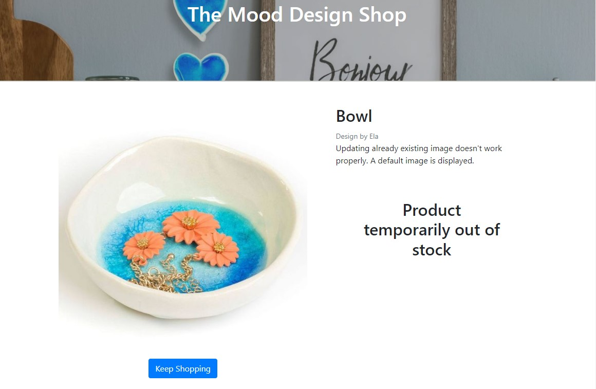

# The Mood Designs Gift Shop


## 1. Overview.

The subject of the project is e-commerce web page application dedicated to Mood Designs Gift Shop that designs and produces handmade, ceramic goods inspired by West Irish folk art and rich natural values of West Ireland the route Wild Atlantic Way. 

The purpose of the application is providing user easy way to present the shops offer and to inform users about new products, offers and news about the Mood Designs team and events taking place within its society. The informations can be easily find on the Home Page or they can be sent do user email in form of Newsletter.

The application allowes users to search Mood Designs products, to buy them and to make secured on-line payments using Credit or Debit cards.
It also allows users to create their profile account to save and store theirs shipping and payment details as well as store theirs orders history.


## Contents:
1. [Project Overview](#1-overview)
2. [User Stories](#2-user-stories)
3. [Features](#3-features)
    * [Home Page](#home-page)
    * [Navigation Bar](#navigation-bar)
    * [Posts](#post)
    * [Footer](#footer)
    * [Shop Page](#shop-page)
    * [Workshop Page](#workshop-page)
    * [Account Page](#account-page)
    * [Register, Login/logout](#register-loginlogout-pages)
    * [Basket Page](#shopping-basket)
    * [Checkout Page](#checkout-page)
4. [Admin Functions](#4-admin-functions)
4. [Future Features](#5-future-features)
5. [Technologies Used](#6-technologies-used)
6. [Database Design](#7-database-design)
7. [Deployment](#8-deployment)
8. [Testing](#9-testing)
8. [References and Credits](#11references-and-credits)


## **2. User Stories:**

### New Site Users

- As a new site user, I would like to  see a userfriendly home page, so that I can easily find interesting content and sections in the Page.
- As a new site user, I would like to Create an account where I can store my personal data so that I don't have to fill up the personal data forms each time I buy something..
- As a new site user, I would like to see contact details so that I can find more information about the shop owners.
- As a new site user, I would like to add items to a shopping Basket, so that I can reserve an item and continue shopping.
- As a new site user, I would like to Delete products from my shopping basket.
- As a new site user, I would like to display the shopping basket so that I can see all reserved items.
- As a new site user, I would like to display single item detail page so that I can get more information about the product.
- As a new site user, I would like to display the Page on mobile devices so I can buy items on a mobile phone.
- As a new site user, I would like to use mobile side bar, so that I can use the application on small size devices.
- As a new site user, I would like to, after adding all items to the shopping basket, to be redirected to the Payment Page so I can finalize the shopping and make a payment.
- As a new site user, I would like to save my personal details needed for making payments, so that I can use them during my next shoppings.
### Returning Site Users

- As a returning site user, I would like to log in/out so that I can use the sites personalized functionalities as well as store and protect my personal data.
- As a returning site user, I would like to sign up to a newsletter to keep up to date with deals and events
- As a returning site user, I would like to Edit my account details so that my profile is up to date.
- As a returning site user, I would like to delete my account so that I can remove my account if I no longer use it.
- As a returning site user, I would like to see if I am logged in or not.
- As a returning site user, I would like to informed by email about actions taken place in the page, so that my account is better secured.
- As a returning site user, I would like to publish my feedback in the page, so that I can share my experience with other users
- As a returning site user, I would like to  Log in with Social media so that I can use my already existing account.
- As a returning site user, I would like to see my previous orders list and payment history .

### Site Admin

- As a site administrator, I should be able to create a superuser account so that I can get access to function only available for sellers.
- As a site administrator, I should be able to add new items to the database, so that I can add new items for sale and save then in the database
- As a site administrator, I should be able to Edit itemsfor sale and save changes to the database
- As a site administrator, I should be able to Delete items from the database, so that They can not be available on sale any more.

## **3. Features.**

### Home Page

Home Page contains informations about the Mood Designs history and lastest news and events organized by the Mood Designs team.


### Navigation Bar

All sections are clearly and simply arranged inside the navigation bar which allows for an easy access to applications sections.


### Post 

Post section displays news and events taking place in the Mood Designs workshop.
This section can be updated by the admin users.


### Footer 

Footer contains The Mood Designs address, social media links and contact details.
It also contains an input field where the user can sign up to newsletter.


### Shop Page

Shop Page displays the list of products available in the Shop.
From here users can add product to the shopping basket.


Each product panel contains a dropdown option button which allows the user to open the products detail page or to add the product to his shopping basket.


In case of an out of stock product Add To Basket button is not available.

### Product Details Page

This section displays more information about the product. SUch as product description quantity of the product on Stock and the Price.

It also allows to choose the number of products and add them to the Shopping Basket.


Out of Stock products can not be added to the Shopping Basket.




### Workshop Page

This section contains workshop activities and events organised by the Mood Designs team. 
Users can get familiar with the events and also they can buy reservations to participate in the activities.


### Account Page

Account section allows users to sign up and create the users account where they can save and securly store their personal information. 
This section is made of two main subsections:

#### My Profile

Where the registered and loged in user can display and manage his informations:
This section also stores user order history.


#### Register, login/logout Pages

The second Account Page subsection where the user can create an account, Login or logout.


Everytime the user is informed about being signed in or signed out.


### Shopping Basket

In the Shopping Basket Page the user can see all the products currently added to bthe shopping basket. The user can also check the total price and delete product or modify the number of each products in the basket.


After overviewing the order the user can be moved to the payment by choosing "Go To Checkout" button.

### Checkout Page

In the Checkout Page user can make a payment for the order. 

The page contains a form that the user has to fill up to provide all the informations required for shipping and billing.

After filling up the form and clicking the Complete Order button the payment will be verified and proceded. 
Also a confirmation email will be sent do the email address provided by the user.


### Summary Page

The Summary Page is displayed after the order is succesfully completed.
It contains all information provided by the user. SUch as orders details, shipping details, orders value and delivery costs.


## **4. Admin Functions:**

Admin users have access to a set of additional functions that allow to provide better level of communication between the Page admins and Customers:

### Adding and Editing Posts on the Home Page:

Users authenticated as Admin users can post information on the Home Page. TO do this he can user a post form displayed in the bottom of the page.


The form contains fields such as post title, author, content but also a list of Newsletters users that can be authomatically informed about publishing the post by sending them a Newsletter.

After filling up the form the post is displayed on the top of the Posts section and it's visible to the users.


The admin has an option to edit the posts content at any time.


### Adding new products to the Shop Page.

Add product button is displayed in the right-bottom corner of the Shop Page. After cicking it the admin user is redirected to the Add Product Form.


The form contains fields for products name, name of the designer, products category, price and the products quantity available in stock.
Also productts image and description can be added.
If the product for any reason doesn't have an image, a default image will be displayed.


After filling up the form the item is getting visible on the shop page and it is available for customers ot buy. Also an information for admin will be displayed.


Admin user can modify the products informations or delete the product from the shop at any time.


### Adding new products to the Shop Page.

The situation with adding Event to the Workshop section look very similarly to adding and managing shop products.

The Add Item button is displayed on the bottom-right corner of the Workshop Page. After clicking the button and filling up the form a new Event is added to the Page.


## **5. Future Features.**


## **6. Technologies used:**

* Python - an interpreted, object-oriented, high-level programming language https://www.python.org/.
* Django - Framework facilitating building full stack web application https://www.djangoproject.com/.
* Django allauth - an authentication module that allows account authentication, registration and management https://django-allauth.readthedocs.io/en/latest/.
* Bootstrap - Powerful, extensible, and feature-packed frontend framework that allows buiding fast and responsive websites: https://getbootstrap.com/.
* Javascript - High-level programming language https://www.javascript.com/.
* HTML5 - Markup language used to make webpages https://html.com/html5/.
* CSS3 - A language used to style HTML and XHTML documents presentations in web development.
* Gitpod - Online integrated development environment https://www.gitpod.io/.
* GitHub - Version control service used for storing and sharing development projects https://github.com/.
* Heroku - a container-based cloud platform where developers can deploy their projects https://www.heroku.com/.
* Amazon Web Services s3 - a cloud-based stporage service. https://aws.amazon.com/
* Stripe - a suite of APIs powering online payment processing and commerce solutions for internet businesses. https://stripe.com/


## **7. Database Design**

The Project contains following classes to describe categories of products, Products features and also classes to describe application users profiles.


### Category
Defines the product category

```python
class Category(models.Model):

    name = models.CharField(max_length=254)
    friendly_name = models.CharField(max_length=254, null=True, blank=True)
```

### Product
Defines product features, such as name, category, price, quantity on stock.

```python
class Product(models.Model):
 DESIGNERS = [
        ('Ela', 'Ela'),
        ('Lukasz', 'Lukasz')
    ]
    category = models.ForeignKey('Category', null=True, blank=True, on_delete=models.SET_NULL)
    created_on = models.DateField(default=timezone.now)
    designer = models.CharField(choices=DESIGNERS, max_length=10, default='Ela')
    name = models.CharField(max_length=254)
    quantity = models.IntegerField(default=0)
    description = models.TextField()
    price = models.DecimalField(max_digits=6, decimal_places=2)
    image = models.ImageField(null=True, blank=True)

    def __str__(self):
        return self.name
```

### User Profile
Defines Profile data of a registered user, such as name, address or phone number.

```python
class UserProfile(models.Model):

    user = models.OneToOneField(User, on_delete=models.CASCADE)
    default_phone_number = models.CharField(max_length=20, null=False, blank=False)
    default_street_address1 = models.CharField(max_length=80, null=False, blank=False)
    default_street_address2 = models.CharField(max_length=80, null=True, blank=True)
    default_town_or_city = models.CharField(max_length=40, null=False, blank=False)
    default_postcode = models.CharField(max_length=20, null=True, blank=True)
    default_county = models.CharField(max_length=80, null=True, blank=True)
    default_country = CountryField(blank_label='Country *', null=False, blank=False)
```

```python
def create_or_update_user_profile(sender, instance, created, **kwargs):

    if created:
        UserProfile.objects.create(user=instance)

    instance.userprofile.save()
```

### Order
Defines Orders features such as order number, user, shipping and billing data, date or delivery costs.

```python
class Order(models.Model):
    order_number = models.CharField(max_length=32, null=False, editable=False)
    user_profile = models.ForeignKey(UserProfile, on_delete=models.SET_NULL,
                                     null=True, blank=True, related_name='orders')
    full_name = models.CharField(max_length=50, null=False, blank=False)
    email = models.EmailField(max_length=254, null=False, blank=False)
    phone_number = models.CharField(max_length=20, null=False, blank=False)
    country = CountryField(blank_label='Country *', null=False, blank=False)
    postcode = models.CharField(max_length=20, null=True, blank=True)
    town_or_city = models.CharField(max_length=40, null=False, blank=False)
    street_address1 = models.CharField(max_length=80, null=False, blank=False)
    street_address2 = models.CharField(max_length=80, null=True, blank=True)
    county = models.CharField(max_length=80, null=True, blank=True)
    date = models.DateTimeField(auto_now_add=True)
    delivery_cost = models.DecimalField(max_digits=6, decimal_places=2, null=False, default=0)
    order_total = models.DecimalField(max_digits=10, decimal_places=2, null=False, default=0)
    grand_total = models.DecimalField(max_digits=10, decimal_places=2, null=False, default=0)
```

```python
class OrderLineItem(models.Model):
    order = models.ForeignKey(Order, null=False, blank=False, on_delete=models.CASCADE, related_name='lineitems')
    product = models.ForeignKey(Product, null=False, blank=False, on_delete=models.CASCADE)
    quantity = models.IntegerField(null=False, blank=False, default=0)
    lineitem_total = models.DecimalField(max_digits=6, decimal_places=2, null=False, blank=False, editable=False)
```

### Newsletter User
Defines Newslatter user. And it stores the email, address the user and the subscription date.

```python 
class NewsletterUser(models.Model):
    email = models.EmailField(max_length=254, null=False, blank=False)
    added_on = models.DateTimeField(auto_now_add=True)
```

### Post
Defines the features of Post that admin users can publish on the Home Page and send them as a Newsletter to Newsletter Users.
It contains fields such as posts title, publishing date, author/designer, image and content and also a list of email addresses of newsletter users.

```python
class Post(models.Model):
    DESIGNERS = [
        ('Ela', 'Ela'),
        ('Lukasz', 'Lukasz')
    ]

    title = models.TextField()
    designer = models.CharField(choices=DESIGNERS, max_length=10, default='Ela')
    created_on = models.DateTimeField(auto_now_add=True)
    updated_on = models.DateTimeField(auto_now=True)
    body = models.TextField()
    image = models.ImageField(null=True, blank=True)
    email = models.ManyToManyField(NewsletterUser)
```

## **8. Deployment.**

The live deployed application can be found on [Heroku](https://mood-design-gift-shop.herokuapp.com/).

### Heroku Deployment

This project uses [Heroku](https://www.heroku.com), a platform as a service (PaaS) that enables developers to build, run, and operate applications entirely in the cloud.

Deployment steps are as follows, after account setup:

- Select *New* in the top-right corner of your Heroku Dashboard, and select *Create new app* from the dropdown menu.
- Your app name must be unique, and then choose a region closest to you (EU or USA), and finally, select *Create App*.
- From the new app *Settings*, click *Reveal Config Vars*, and set the following key/value pairs:
  - `CLOUDINARY_URL` (insert your own Cloudinary API key here)
  - `DATABASE_URL` (this comes from the **Resources** tab, you can get your own Postgres Database using the Free Hobby Tier)
  - `SECRET_KEY` (this can be any random secret key)
  - `PORT` (8000)

Heroku needs two additional files in order to deploy properly.
- requirements.txt
- Procfile

You can install this project's requirements (where applicable) using: `pip3 install -r requirements.txt`.
If you have your own packages that have been installed, then the requirements file needs updated using: `pip3 freeze --local > requirements.txt`

The Procfile can be created with the following command: `echo web: gunicorn shoppinglist.wsgi > Procfile`

For Heroku deployment, follow these steps to connect your GitHub repository to the newly created app:

Either:
- Select "Automatic Deployment" from the Heroku app.

Or:
- In the Terminal/CLI, connect to Heroku using this command: `heroku login -i`
- Set the remote for Heroku: `heroku git:remote -a <app_name>` (replace app_name with your app, without the angle-brackets)
- After performing the standard Git `add`, `commit`, and `push` to GitHub, you can now type: `git push heroku main`

The frontend terminal should now be connected and deployed to Heroku.

### Local Deployment

*Gitpod* IDE was used to write the code for this project.

You can clone the repository by following these steps:

1. Go to the [GitHub repository](https://github.com/TomaszWoloszyn983/mood-design-gift-shop) 
2. Locate the Code button above the list of files and click it 
3. Select if you prefer to clone using HTTPS, SSH, or GitHub CLI and click the copy button to copy the URL to your clipboard
4. Open Git Bash or Terminal
5. Change the current working directory to the one where you want the cloned directory
6. In your IDE Terminal, type the following command to clone my repository:
	- `git clone https://github.com/TomaszWoloszyn983/mood-design-gift-shop.git`
7. Press Enter to create your local clone.

You can install this project's requirements (where applicable) using: `pip3 install -r requirements.txt`.

You will need to create a new file called `env.py`, and include the same environment variables listed above for Heroku deployment steps.

Alternatively, if using Gitpod, you can click below to create your own workspace using this repository.

[](https://gitpod.io/#https://github.com/TomaszWoloszyn983/mood-design-gift-shop)

## **9. Testing.**

The Application is fully responsive and the applications code was tested using:
* Nu Html Checker for html code https://validator.w3.org/nu/.
* W3C CSS Validator for css code https://jigsaw.w3.org/css-validator/.
* Jshint for Java Script code https://jshint.com/.
* CI Python Linter for Python code https://pep8ci.herokuapp.com/.

There were no issues detected by most of the test, although there where some errors implemented with add-ons.
More details about testings and unfixed issues are available in the dedicated testing section [here](TESTING.md).

## **10. GitHub Issues.**


There, I used my own **User Story Template** to manage user stories.

It also helped with milestone iterations on a weekly basis.

Consider adding a screenshot of your Open and Closed Issues.

- [Open Issues](https://github.com/TomaszWoloszyn983/mood-design-gift-shop/issues?q=is%3Aopen+is%3Aissue)

    

- [Closed Issues](https://github.com/TomaszWoloszyn983/mood-design-gift-shop/issues?q=is%3Aissue+is%3Aclosed)

    

### **MoSCoW Prioritization**

I've decomposed my Epics into stories prior to prioritizing and implementing them.
Using this approach, I was able to apply the MoSCow prioritization and labels to my user stories within the Issues tab.


- **Must Have**: guaranteed to be delivered (*max 60% of stories*)
- **Should Have**: adds significant value, but not vital (*the rest ~20% of stories*)
- **Could Have**: has small impact if left out (*20% of stories*)
- **Won't Have**: not a priority for this iteration


## **11References and Credits:**
- You Tube video tutorial how to create 3D Parallax landing page effect - https://www.youtube.com/watch?v=Nt70Ld0dJCM

- You Tube tutorial how to choose colors - https://www.youtube.com/watch?v=KMS3VwGh3HY&list=WL&index=102

- You Tube tutorial on sending newsletters - https://www.youtube.com/watch?v=C9rszGfDMYM
