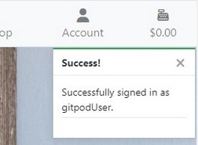
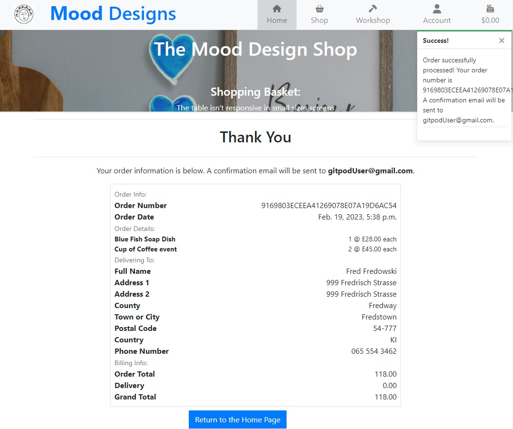

# **The Mood Designs Gift Shop**


## **1. Overview.**

The subject of the project is an e-commerce web page application dedicated to Mood Designs Gift Shop that designs and produces handmade, ceramic goods inspired by West Irish folk art and rich natural values of West Ireland along the route Wild Atlantic Way. 

The purpose of the application is to provide an user easy way to present the shop's offer and to inform users about new products, offers and news about the Mood Designs team and events taking place within its society. The information can be easily found on the Home Page or they can be sent do user email in form of Newsletter.

The application allows users to search Mood Designs products, to buy them and to make secured on-line payments using Credit or Debit cards.
It also allows users to create their profile account to save and store their shipping and payment details as well as store their orders history.


## **Contents:**
1. [Project Overview](#1-overview)
2. [User Stories](#2-user-stories)
3. [Features](#3-features)
    * [Home Page](#home-page)
    * [Navigation Bar](#navigation-bar)
    * [Posts](#post)
    * [Footer](#footer)
    * [Newsletter](#newsletter)
    * [Shop Page](#shop-page)
    * [Workshop Page](#workshop-page)
    * [Account Page](#account-page)
    * [Register, Login/logout](#register-loginlogout-pages)
    * [Basket Page](#shopping-basket)
    * [Checkout Page](#checkout-page)
4. [Admin Functions](#4-admin-functions)
5. [Color Scheme](#5-colour-scheme)
5. [Future Features](#5-future-features)
6. [Technologies Used](#6-technologies-used)
7. [Database Design](#7-database-design)
8. [Deployment](#8-deployment)
    * [Heroku Deployment](#heroku-deployment)
    * [Local Deployment](#local-deployment)
9. [Testing](#9-testing)
10. [Agile Development Process](#10-agile-development-process)
11. [Search Engine Optimization](#11-search-engine-optimization-seo--social-media-marketing)
    * [Keywords](#keywords)
    * [Robots](#robots)
    * [Sitemap](#sitemap)
12. [Social Media Marketing](#12-social-media-marketing)
13. [Newsletter Marketing](#13-newsletter-marketing)
14. [References and Credits](#14-references-and-credits)


## **2. User Stories:**

### New Site Users

- As a new site user, I would like to  see a user-friendly home page, so that I can easily find interesting content and sections in the Page.
- As a new site user, I would like to Create an account where I can store my personal data so that I don't have to fill up the personal data forms each time I buy something..
- As a new site user, I would like to see contact details so that I can find more information about the shop owners.
- As a new site user, I would like to add items to a shopping Basket, so that I can reserve an item and continue shopping.
- As a new site user, I would like to Delete products from my shopping basket.
- As a new site user, I would like to display the shopping basket so that I can see all reserved items.
- As a new site user, I would like to display a single item detail page so that I can get more information about the product.
- As a new site user, I would like to display the Page on mobile devices so I can buy items on a mobile phone.
- As a new site user, I would like to use a mobile sidebar, so that I can use the application on small size devices.
- As a new site user, I would like to, after adding all items to the shopping basket, to be redirected to the Payment Page so I can finalize the shopping and make a payment.
- As a new site user, I would like to save my personal details needed for making payments, so that I can use them during my next shoppings.
### Returning Site Users

- As a returning site user, I would like to log in/out so that I can use the site's personalized functionalities as well as store and protect my personal data.
- As a returning site user, I would like to sign up to a newsletter to keep up to date with deals and events
- As a returning site user, I would like to Edit my account details so that my profile is up to date.
- As a returning site user, I would like to delete my account so that I can remove my account if I no longer use it.
- As a returning site user, I would like to see if I am logged in or not.
- As a returning site user, I would like to be informed by email about actions taken place in the page, so that my account is better secured.
- As a returning site user, I would like to publish my feedback in the page, so that I can share my experience with other users
- As a returning site user, I would like to  Log in with Social media so that I can use my already existing account.
- As a returning site user, I would like to see my previous orders list and payment history .

### Site Admin

- As a site administrator, I should be able to create a superuser account so that I can get access to functions only available for sellers.
- As a site administrator, I should be able to add new items to the database, so that I can add new items for sale and save then in the database
- As a site administrator, I should be able to Edit items for sale and save changes to the database.
- As a site administrator, I should be able to Delete items from the database, so that they can not be available on sale any more.

## **3. Features.**

### Home Page

Home Page contains information about the Mood Designs history and latest news and events organized by the Mood Designs team.


### Navigation Bar

All sections are clearly and simply arranged inside the navigation bar which allows for easy access to application's sections.


### Post 

Post section displays news and events taking place in the Mood Designs workshop.
This section can be updated by the admin users.


### Footer 

Footer contains The Mood Designs address, social media links and contact details.
It also contains an input field where the user can sign up to the newsletter.


### Newsletter

The application provides a function of sending Newsletter to users who want to receive such a form of being informed about news and latest events. 

To sign up for a newsletter the user needs to go to the Footer section in the Home Page and enter its email address in the input field. 


A confirmation email will be sent to the user straight away.


And the user will be added to Newsletter Users list. 

### Shop Page

Shop Page displays the list of products available in the Shop.
From here users can add products to the shopping basket.


Each product panel contains a dropdown option button which allows the user to open the products detail page or to add the product to his shopping basket.


In case of an out of stock product, Add To Basket button is not available.

### Product Details Page

This section displays more information about the product. Such as product description quantity of the product on Stock and the Price.

It also allows you to choose the number of products and add them to the Shopping Basket.


Out of Stock products can not be added to the Shopping Basket.


### **Workshop Page**

This section contains workshop activities and events organized by the Mood Designs team. 
Users can get familiar with the events and also they can buy reservations to participate in the activities.


### **Account Page**

Account section allows users to sign up and create the users account where they can save and securely store their personal information. 
This section is made of two main subsections:

#### My Profile

Where the registered and logged in user can display and manage his information.
This section also stores user order history.


#### Register, login/logout Pages

The second Account Page subsection where the user can create an account, Login or logout.


Everytime the user is informed about being signed in or signed out.




### **Shopping Basket**

In the Shopping Basket Page the user can see all the products currently added to the shopping basket. The user can also check the total price and delete products or modify the number of each product in the basket.


After overviewing the order the user can be moved to the payment by choosing the "Go To Checkout" button.

### **Checkout Page**

In the Checkout Page user can make a payment for the order. 

The page contains a form that the user has to fill up to provide all the information required for shipping and billing.

After filling up the form and clicking the Complete Order button the payment will be verified and proceeded. 
Also a confirmation email will be sent to the email address provided by the user.


### **Summary Page**

The Summary Page is displayed after the order is successfully completed.
It contains all information provided by the user. Such as orders details, shipping details, orders value and delivery costs.



## **4. Admin Functions:**

Admin users have access to a set of additional functions that allow to provide better level of communication between the Page admins and Customers:

### **Adding and editing Posts in the Home Page:**

Users authenticated as Admin users can post information on the Home Page. To do this he can use a post form displayed in the bottom of the page.


The form contains fields such as post title, author, content but also a list of Newsletters users that can be automatically informed about publishing the post by sending them a Newsletter.

After filling up the form the post is displayed on the top of the Posts section and it's visible to the users.

To prevent overextending the Home Page only the last five posts are displayed in the page.

Post can only be **deleted in the admin panel** by the superuser.


The admin is able to edit the posts content at any time.


However deleting Posts can be made only throughout the admin panel.

### **Adding new products to the Shop Page.**

Add product button is displayed in the right-bottom corner of the Shop Page. After clicking it the admin user is redirected to the Add Product Form.


The form contains fields for product name, name of the designer, product category, price and the product quantity available in stock.
Also products image and description can be added.
If the product for any reason doesn't have an image, a default image will be displayed.


After filling up the form the item is getting visible on the shop page and it is available for customers to buy. Also information for admin will be displayed.


Admin users can modify the products information or delete the product from the shop at any time.


### **Adding new products to the Workshop Page.**

The situation with adding Event to the Workshop section looks very similar to adding and managing shop products.

The Add Item button is displayed on the bottom-right corner of the Workshop Page. After clicking the button and filling up the form a new Event is added to the Page.


## **5. Future Features.**

Features and functionalities that have not been implemented at this stage, but they are planned to be implemented in the future.

* Log in using a Social Media account.
* User Feedback and opinions.
* Delete Account function.
* Adding profile photos to the side navigation bar.


## **5. Colour Scheme**

Colors used in this project:

- `#000000` used for primary text.
- `#2986ff` user for header text, buttons and navbar hover effect.
- `#80888a4d` used for navbar active buttons.
- `#DC4C64` danger elements such as removing or deleting items and error messages.
- `#14A44D` add item button, success messages.


## **6. Technologies used:**

* Python - an interpreted, object-oriented, high-level programming language https://www.python.org/.
* Django - Framework facilitating building full stack web application https://www.djangoproject.com/.
* Django allauth - an authentication module that allows account authentication, registration and management https://django-allauth.readthedocs.io/en/latest/.
* Bootstrap - Powerful, extensible, and feature-packed frontend framework that allows building fast and responsive websites: https://getbootstrap.com/.
* Javascript - High-level programming language https://www.javascript.com/.
* HTML5 - Markup language used to make web pages https://html.com/html5/.
* CSS3 - A language used to style HTML and XHTML documents presentations in web development.
* CSS Flexbox and CSS Grid - used for an enhanced responsive layout.
* Gitpod - Online integrated development environment https://www.gitpod.io/.
* GitHub - Version control service used for storing and sharing development projects https://github.com/.
* GitHub Pages - Used for hosting the deployed front-end site.
* Heroku - a container-based cloud platform where developers can deploy their projects https://www.heroku.com/.
* Markdown Builder by Tim Nelson https://traveltimn.github.io/markdown-builder used to help generate the Markdown files.
* PostgreSQL - used as the relational database management https://www.postgresql.org.
* ElephantSQL - used as the Postgres database https://www.elephantsql.com.
* Amazon Web Services s3 - a cloud-based storage service. https://aws.amazon.com/
* Stripe - a suite of APIs powering online payment processing and commerce solutions for internet businesses. https://stripe.com/


## **7. Database Design**

The Project contains following classes to describe categories of products, Products features and also classes to describe application users profiles, newsletter users, Orders, Posts in the Home Page.


### **Category**
Defines the product category

```python
class Category(models.Model):

    name = models.CharField(max_length=254)
    friendly_name = models.CharField(max_length=254, null=True, blank=True)
```

### **Product**
Defines product features, such as name, category, price, quantity on stock.

```python
class Product(models.Model):
 DESIGNERS = [
        ('Ela', 'Ela'),
        ('Lukasz', 'Lukasz')
    ]
    category = models.ForeignKey('Category', null=True, blank=True, on_delete=models.SET_NULL)
    created_on = models.DateField(default=timezone.now)
    designer = models.CharField(choices=DESIGNERS, max_length=10, default='Ela')
    name = models.CharField(max_length=254)
    quantity = models.IntegerField(default=0)
    description = models.TextField()
    price = models.DecimalField(max_digits=6, decimal_places=2)
    image = models.ImageField(null=True, blank=True)

    def __str__(self):
        return self.name
```

### **User Profile**
Defines Profile data of a registered user, such as name, address or phone number.

```python
class UserProfile(models.Model):

    user = models.OneToOneField(User, on_delete=models.CASCADE)
    default_phone_number = models.CharField(max_length=20, null=False, blank=False)
    default_street_address1 = models.CharField(max_length=80, null=False, blank=False)
    default_street_address2 = models.CharField(max_length=80, null=True, blank=True)
    default_town_or_city = models.CharField(max_length=40, null=False, blank=False)
    default_postcode = models.CharField(max_length=20, null=True, blank=True)
    default_county = models.CharField(max_length=80, null=True, blank=True)
    default_country = CountryField(blank_label='Country *', null=False, blank=False)
```

```python
def create_or_update_user_profile(sender, instance, created, **kwargs):

    if created:
        UserProfile.objects.create(user=instance)

    instance.userprofile.save()
```

### **Order**
Defines Orders features such as order number, user, shipping and billing data, date or delivery costs.

```python
class Order(models.Model):
    order_number = models.CharField(max_length=32, null=False, editable=False)
    user_profile = models.ForeignKey(UserProfile, on_delete=models.SET_NULL,
                                     null=True, blank=True, related_name='orders')
    full_name = models.CharField(max_length=50, null=False, blank=False)
    email = models.EmailField(max_length=254, null=False, blank=False)
    phone_number = models.CharField(max_length=20, null=False, blank=False)
    country = CountryField(blank_label='Country *', null=False, blank=False)
    postcode = models.CharField(max_length=20, null=True, blank=True)
    town_or_city = models.CharField(max_length=40, null=False, blank=False)
    street_address1 = models.CharField(max_length=80, null=False, blank=False)
    street_address2 = models.CharField(max_length=80, null=True, blank=True)
    county = models.CharField(max_length=80, null=True, blank=True)
    date = models.DateTimeField(auto_now_add=True)
    delivery_cost = models.DecimalField(max_digits=6, decimal_places=2, null=False, default=0)
    order_total = models.DecimalField(max_digits=10, decimal_places=2, null=False, default=0)
    grand_total = models.DecimalField(max_digits=10, decimal_places=2, null=False, default=0)
```

```python
class OrderLineItem(models.Model):
    order = models.ForeignKey(
        Order, null=False, blank=False, on_delete=models.CASCADE
        related_name='lineitems')
    product = models.ForeignKey(
        Product, null=False, blank=False, on_delete=models.CASCADE)
    quantity = models.IntegerField(null=False, blank=False, default=0)
    lineitem_total = models.DecimalField(
        max_digits=6, decimal_places=2, null=False, blank=False
        editable=False)
```

### **Newsletter User**
Defines Newsletter user. And it stores the email, address the user and the subscription date.

```python 
class NewsletterUser(models.Model):
    email = models.EmailField(max_length=254, null=False, blank=False)
    added_on = models.DateTimeField(auto_now_add=True)
```

### **Post**
Posts can be published in the Home Page by the admin to inform guests users about the news about the Shop. Posts can also be automatically sent to Newsletter users to be chosen by the admin.
The class contains fields such as posts title, publishing date, author/designer, image and content and also a list of email addresses of newsletter users.

```python
class Post(models.Model):
    DESIGNERS = [
        ('Ela', 'Ela'),
        ('Lukasz', 'Lukasz')
    ]

    title = models.TextField()
    designer = models.CharField(choices=DESIGNERS, max_length=10, default='Ela')
    created_on = models.DateTimeField(auto_now_add=True)
    updated_on = models.DateTimeField(auto_now=True)
    body = models.TextField()
    image = models.ImageField(null=True, blank=True)
    email = models.ManyToManyField(NewsletterUser)
```


## **8. Deployment.**

The live deployed application can be found [Here](https://mood-design-gift-shop.herokuapp.com/).


### **ElephantSQL Database**

This project uses [ElephantSQL](https://www.elephantsql.com) for the PostgreSQL Database.

To obtain your own Postgres Database, sign-up with your GitHub account, then follow these steps:
- Click **Create New Instance** to start a new database.
- Provide a name (this is commonly the name of the project: mood-design-gift-shop).
- Select the **Tiny Turtle (Free)** plan.
- You can leave the **Tags** blank.
- Select the **Region** and **Data Center** closest to you.
- Once created, click on the new database name, where you can view the database URL and Password.

### **Amazon AWS**

This project uses [AWS](https://aws.amazon.com) to store media and static files online, due to the fact that Heroku doesn't persist this type of data.

Once you've created an AWS account and logged-in, follow these series of steps to get your project connected.
Make sure you're on the **AWS Management Console** page.

#### **S3 Bucket**

- Search for **S3**.
- Create a new bucket, give it a name (matching your Heroku app name), and choose the region closest to you.
- Uncheck **Block all public access**, and acknowledge that the bucket will be public (required for it to work on Heroku).
- From **Object Ownership**, make sure to have **ACLs enabled**, and **Bucket owner preferred** selected.
- From the **Properties** tab, turn on static website hosting, and type `index.html` and `error.html` in their respective fields, then click **Save**.
- From the **Permissions** tab, paste in the following CORS configuration:

	```shell
	[
		{
			"AllowedHeaders": [
				"Authorization"
			],
			"AllowedMethods": [
				"GET"
			],
			"AllowedOrigins": [
				"*"
			],
			"ExposeHeaders": []
		}
	]
	```

- Copy your **ARN** string.
- From the **Bucket Policy** tab, select the **Policy Generator** link, and use the following steps:
	- Policy Type: **S3 Bucket Policy**
	- Effect: **Allow**
	- Principal: `*`
	- Actions: **GetObject**
	- Amazon Resource Name (ARN): **paste-your-ARN-here**
	- Click **Add Statement**
	- Click **Generate Policy**
	- Copy the entire Policy, and paste it into the **Bucket Policy Editor**

		```shell
		{
			"Id": "Policy1234567890",
			"Version": "2012-10-17",
			"Statement": [
				{
					"Sid": "Stmt1234567890",
					"Action": [
						"s3:GetObject"
					],
					"Effect": "Allow",
					"Resource": "arn:aws:s3:::your-bucket-name/*"
					"Principal": "*",
				}
			]
		}
		```

	- Before you click "Save", add `/*` to the end of the Resource key in the Bucket Policy Editor (like above).
	- Click **Save**.
- From the **Access Control List (ACL)** section, click "Edit" and enable **List** for **Everyone (public access)**, and accept the warning box.
	- If the edit button is disabled, you need to change the **Object Ownership** section above to **ACLs enabled** (mentioned above).

#### **IAM**

Back on the AWS Services Menu, search for and open **IAM** (Identity and Access Management).
Once on the IAM page, follow these steps:

- From **User Groups**, click **Create New Group**.
	- Suggested Name: `group-mood-design-gift-shop` (group + the project name)
- Tags are optional, but you must click it to get to the **review policy** page.
- From **User Groups**, select your newly created group, and go to the **Permissions** tab.
- Open the **Add Permissions** dropdown, and click **Attach Policies**.
- Select the policy, then click **Add Permissions** at the bottom when finished.
- From the **JSON** tab, select the **Import Managed Policy** link.
	- Search for **S3**, select the `AmazonS3FullAccess` policy, and then **Import**.
	- You'll need your ARN from the S3 Bucket copied again, which is pasted into the "Resources" key on the Policy.

		```shell
		{
			"Version": "2012-10-17",
			"Statement": [
				{
					"Effect": "Allow",
					"Action": "s3:*",
					"Resource": [
						"arn:aws:s3:::your-bucket-name",
						"arn:aws:s3:::your-bucket-name/*"
					]
				}
			]
		}
		```
	
	- Click **Review Policy**.
	- Suggested Name: `policy-mood-design-gift-shop` (policy + the project name)
	- Provide a description:
		- "Access to S3 Bucket for mood-design-gift-shop static files."
	- Click **Create Policy**.
- From **User Groups**, click your "group-mood-design-gift-shop".
- Click **Attach Policy**.
- Search for the policy you've just created ("policy-mood-design-gift-shop") and select it, then **Attach Policy**.
- From **User Groups**, click **Add User**.
	- Suggested Name: `user-mood-design-gift-shop` (user + the project name)
- For "Select AWS Access Type", select **Programmatic Access**.
- Select the group to add your new user to: `group-mood-design-gift-shop`
- Tags are optional, but you must click it to get to the **review user** page.
- Click **Create User** once done.
- You should see a button to **Download .csv**, so click it to save a copy on your system.
	- **IMPORTANT**: once you pass this page, you cannot come back to download it again, so do it immediately!
	- This contains the user's **Access key ID** and **Secret access key**.
	- `AWS_ACCESS_KEY_ID` = **Access key ID**
	- `AWS_SECRET_ACCESS_KEY` = **Secret access key**

#### **Final AWS Setup**

- If Heroku Config Vars still havehas `DISABLE_COLLECTSTATIC` still, this can be removed now, so that AWS will handle the static files.
- Back within **S3**, create a new folder called: `media`.
- Select any existing media images for your project to prepare them for being uploaded into the new folder.
- Under **Manage Public Permissions**, select **Grant public read access to this object(s)**.
- No further settings are required, so click **Upload**.

### **Stripe API**

This project uses [Stripe](https://stripe.com) to handle the ecommerce payments.

Once you've created a Stripe account and logged-in, follow these series of steps to get your project connected.

- From your Stripe dashboard, click to expand the "Get your test API keys".
- You'll have two keys here:
	- `STRIPE_PUBLIC_KEY` = Publishable Key (starts with **pk**)
	- `STRIPE_SECRET_KEY` = Secret Key (starts with **sk**)


### **Gmail API**

This project uses [Gmail](https://mail.google.com) to handle sending emails to users for account verification and purchase order confirmations.

Once you've created a Gmail (Google) account and logged-in, follow these series of steps to get your project connected.

- Click on the **Account Settings** (cog icon) in the top-right corner of Gmail.
- Click on the **Accounts and Import** tab.
- Within the section called "Change account settings", click on the link for **Other Google Account settings**.
- From this new page, select **Security** on the left.
- Select **2-Step Verification** to turn it on. (verify your password and account)
- Once verified, select **Turn On** for 2FA.
- Navigate back to the **Security** page, and you'll see a new option called **App passwords**.
- This might prompt you once again to confirm your password and account.
- Select **Mail** for the app type.
- Select **Other (Custom name)** for the device type.
	- Any custom name, such as "Django" or mood-design-gift-shop
- You'll be provided with a 16-character password (API key).
	- Save this somewhere locally, as you cannot access this key again later!
	- `EMAIL_HOST_PASS` = your new 16-character API key
	- `EMAIL_HOST_USER` = your own personal Gmail email address (`you@gmail.com`)

### **Heroku Deployment**

This project uses [Heroku](https://www.heroku.com), a platform as a service (PaaS) that enables developers to build, run, and operate applications entirely in the cloud.

Deployment steps are as follows, after account setup:

- Select *New* in the top-right corner of your Heroku Dashboard, and select *Create new app* from the dropdown menu.
- Your app name must be unique, and then choose a region closest to you (EU or USA), and finally, select *Create App*.
- From the new app *Settings*, click *Reveal Config Vars*, and set the following key/value pairs:

    | Key | Value |
    | --- | --- |
    | `AWS_ACCESS_KEY_ID` | insert your own AWS Access Key ID key here |
    | `AWS_SECRET_ACCESS_KEY` | insert your own AWS Secret Access key here |
    | `DATABASE_URL` | insert your own ElephantSQL database URL here |
    | `DISABLE_COLLECTSTATIC` | 1 (*this is temporary, and can be removed for the final deployment*) |
    | `EMAIL_HOST_PASS` | insert your own Gmail API key here |
    | `EMAIL_HOST_USER` | insert your own Gmail email address here |
    | `SECRET_KEY` | this can be any random secret key |
    | `STRIPE_PUBLIC_KEY` | insert your own Stripe Public API key here |
    | `STRIPE_SECRET_KEY` | insert your own Stripe Secret API key here |
    | `STRIPE_WH_SECRET` | insert your own Stripe Webhook API key here |
    | `USE_AWS` | True |

Heroku needs two additional files in order to deploy properly.
- requirements.txt
- Procfile

You can install this project's requirements (where applicable) using: `pip3 install -r requirements.txt`.
If you have your own packages that have been installed, then the requirements file needs updated using: `pip3 freeze --local > requirements.txt`

The Procfile can be created with the following command: `echo web: gunicorn shoppinglist.wsgi > Procfile`

For Heroku deployment, follow these steps to connect your GitHub repository to the newly created app:

Either:
- Select "Automatic Deployment" from the Heroku app.

Or:
- In the Terminal/CLI, connect to Heroku using this command: `heroku login -i`
- Set the remote for Heroku: `heroku git:remote -a <app_name>` (replace app_name with your app, without the angle-brackets)
- After performing the standard Git `add`, `commit`, and `push` to GitHub, you can now type: `git push heroku main`

The frontend terminal should now be connected and deployed to Heroku.

### **Local Deployment**

*Gitpod* IDE was used to write the code for this project.

You can clone the repository by following these steps:

1. Go to the [GitHub repository](https://github.com/TomaszWoloszyn983/mood-design-gift-shop) 
2. Locate the Code button above the list of files and click it 
3. Select if you prefer to clone using HTTPS, SSH, or GitHub CLI and click the copy button to copy the URL to your clipboard
4. Open Git Bash or Terminal
5. Change the current working directory to the one where you want the cloned directory
6. In your IDE Terminal, type the following command to clone my repository:
	- `git clone https://github.com/TomaszWoloszyn983/mood-design-gift-shop.git`
7. Press Enter to create your local clone.

You can install this project's requirements (where applicable) using: `pip3 install -r requirements.txt`.

You will need to create a new file called `env.py`, and include the same environment variables listed above for Heroku deployment steps.

Sample `env.py` file:

```python
import os

os.environ.setdefault("AWS_ACCESS_KEY_ID", "insert your own AWS Access Key ID key here")
os.environ.setdefault("AWS_SECRET_ACCESS_KEY", "insert your own AWS Secret Access key here")
os.environ.setdefault("DATABASE_URL", "insert your own ElephantSQL database URL here")
os.environ.setdefault("EMAIL_HOST_PASS", "insert your own Gmail API key here")
os.environ.setdefault("EMAIL_HOST_USER", "insert your own Gmail email address here")
os.environ.setdefault("SECRET_KEY", "this can be any random secret key")
os.environ.setdefault("STRIPE_PUBLIC_KEY", "insert your own Stripe Public API key here")
os.environ.setdefault("STRIPE_SECRET_KEY", "insert your own Stripe Secret API key here")
```

Once the project is cloned or forked, in order to run it locally, you'll need to follow these steps:
- Start the Django app: `python3 manage.py runserver`
- Stop the app once it's loaded: `CTRL+C` or `⌘+C` (Mac)
- Make any necessary migrations: `python3 manage.py makemigrations`
- Migrate the data to the database: `python3 manage.py migrate`
- Create a superuser: `python3 manage.py createsuperuser`
- Load fixtures (if applicable): `python3 manage.py loaddata file-name.json` (repeat for each file)
- Everything should be ready now, so run the Django app again: `python3 manage.py runserver`

If you'd like to backup your database models, use the following command for each model you'd like to create a fixture for:
- `python3 manage.py dumpdata your-model > your-model.json`
- *repeat this action for each model you wish to backup*

#### **Cloning**

You can clone the repository by following these steps:

1. Go to the [GitHub repository](https://github.com/TomaszWoloszyn983/mood-design-gift-shop) 
2. Locate the Code button above the list of files and click it 
3. Select if you prefer to clone using HTTPS, SSH, or GitHub CLI and click the copy button to copy the URL to your clipboard
4. Open Git Bash or Terminal
5. Change the current working directory to the one where you want the cloned directory
6. In your IDE Terminal, type the following command to clone my repository:
	- `git clone https://github.com/TomaszWoloszyn983/mood-design-gift-shop.git`
7. Press Enter to create your local clone.


Alternatively, if using Gitpod, you can click below to create your own workspace using this repository.

[](https://gitpod.io/#https://github.com/TomaszWoloszyn983/mood-design-gift-shop)


#### **Forking**

By forking the GitHub Repository, we make a copy of the original repository on our GitHub account to view and/or make changes without affecting the original owner's repository.
You can fork this repository by using the following steps:

1. Log in to GitHub and locate the [GitHub Repository](https://github.com/TomaszWoloszyn983/mood-design-gift-shop)
2. At the top of the Repository (not top of page) just above the "Settings" Button on the menu, locate the "Fork" Button.
3. Once clicked, you should now have a copy of the original repository in your own GitHub account!


## **9. Testing.**

The Application is fully responsive and the applications code was tested using:
* Nu Html Checker for html code https://validator.w3.org/nu/.
* W3C CSS Validator for css code https://jigsaw.w3.org/css-validator/.
* Jshint for Java Script code https://jshint.com/.
* CI Python Linter for Python code https://pep8ci.herokuapp.com/.

There were no issues detected by most of the tests.
More details about the testing process and methods are available in the dedicated testing section [here](TESTING.md).


## **10. Agile Development Process**

### **GitHub Projects**


[GitHub Projects](https://github.com/TomaszWoloszyn983/mood-design-gift-shop/projects) served as an Agile tool for this project.
It isn't a specialized tool, but with the right tags and project creation/issue assignments, it can be made to work.

Through it, user stories, issues, and milestone tasks were planned, then tracked on a weekly basis using the basic Kanban board.

- [Open Issues](https://github.com/TomaszWoloszyn983/mood-design-gift-shop/issues?q=is%3Aopen+is%3Aissue)

    


- [Closed Issues](https://github.com/TomaszWoloszyn983/mood-design-gift-shop/issues?q=is%3Aissue+is%3Aclosed)

    

- [Milestones](https://github.com/TomaszWoloszyn983/mood-design-gift-shop/milestones?state=closed)

    

### **MoSCoW Prioritization**

I've decomposed my Epics into stories prior to prioritizing and implementing them.
Using this approach, I was able to apply the MoSCow prioritization and labels to my user stories within the Issues tab.


- **Must Have**: guaranteed to be delivered (*max 60% of stories*)
- **Should Have**: adds significant value, but not vital (*the rest ~20% of stories*)
- **Could Have**: has small impact if left out (*20% of stories*)
- **Won't Have**: not a priority for this iteration
- **Future Features**: Features and functionalities intended for future implementations.


## **11. Search Engine Optimization (SEO) & Social Media Marketing**

### Keywords

I've identified some appropriate keywords to align with my site that should help users when searching online to find my page easily from a search engine.

Keywords: mood, design, gift, shop, application, page

### Sitemap

I've used [XML-Sitemaps](https://www.xml-sitemaps.com) to generate a sitemap.xml file.
This was generated using my deployed site URL: https://mood-design-gift-shop.herokuapp.com

After it finished crawling the entire site, it created a
[sitemap.xml](sitemap.xml) which I've downloaded and included in the repository.

### Robots

I've created the [robots.txt](robots.txt) file at the root-level.
Inside, I've included the default settings:

```
User-agent: *
Disallow: /account/
Disallow: /basket/
Sitemap: https://mood-design-gift-shop.herokuapp.com/sitemap.xml
```

Further links for future implementation:
- [Google search console](https://search.google.com/search-console)
- [Creating and submitting a sitemap](https://developers.google.com/search/docs/advanced/sitemaps/build-sitemap)
- [Managing your sitemaps and using sitemaps reports](https://support.google.com/webmasters/answer/7451001)
- [Testing the robots.txt file](https://support.google.com/webmasters/answer/6062598)

## **12. Social Media Marketing**

Creating a strong social base (with participation) and linking that to the business site can help drive sales.
Using more popular providers with a wider user base, such as Facebook, typically maximizes site views.


The link to Facebook page is available here - [Mood Designs Facebook Page](https://www.facebook.com/profile.php?id=100090776198805)


## **13. Newsletter Marketing**

I have incorporated a newsletter sign-up form to my application, to allow users to supply their email address if they are interested in learning more. 

More information [Here](#newsletter).

## **14. References and Credits:**
- You Tube video tutorial how to create 3D Parallax landing page effect - https://www.youtube.com/watch?v=Nt70Ld0dJCM

- You Tube tutorial how to choose colors - https://www.youtube.com/watch?v=KMS3VwGh3HY&list=WL&index=102

- You Tube tutorial on sending newsletters - https://www.youtube.com/watch?v=C9rszGfDMYM

- How to create a nice login form  - https://www.youtube.com/watch?v=ylFLVBbB9AM

- You Tube tutorial on how to create a Parallax landing page using Bootstrap - https://www.youtube.com/watch?v=fu_shslaI14

- Tutorial on Css Selector - https://www.youtube.com/watch?v=l1mER1bV0N0

- Tutorial on Stripe Payments - https://www.youtube.com/watch?v=r64QE2d1jGc

### **Media**

All images and materials used at this project belong to Mood Designs and were taken from the official Mood Designs web page and their Facebook page with knowledge and consent of the copyrights owners.

Link to Mood Designs images: 

https://www.themooddesigns.ie/
https://www.themooddesigns.ie/shop
https://www.themooddesigns.ie/ceramic-workshops
https://www.themooddesigns.ie/wholesale
https://www.themooddesigns.ie/process
https://www.facebook.com/photo.php?fbid=592945419511605&set=pb.100063884567594.-2207520000.&type=3
https://www.facebook.com/photo.php?fbid=592945416178272&set=pb.100063884567594.-2207520000.&type=3


### **Acknowledgements**

- I would like to thank my Code Institute mentor Tim Nelson for his support throughout the development of this project.
- I would like to thank the [Code Institute](https://codeinstitute.net) tutor team and the whole Code Institute team for their assistance with troubleshooting and debugging some project issues.
- I would like to thank Ela and Lukasz Szczerbak - the owners of the Mood Design shop for inspiration and support.
- I would like to thank my wife Marlena, for believing in me, and allowing me to make this transition into software development.
