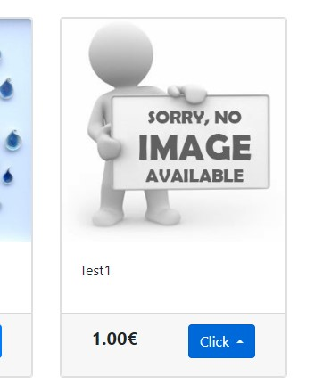
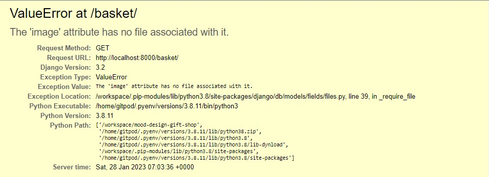
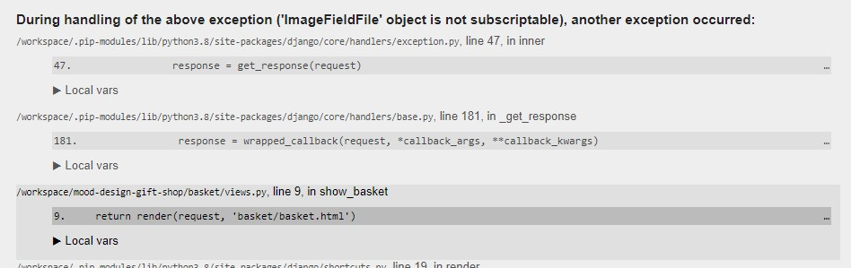
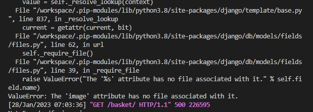

# Testing


##  **Responsiveness**
- The project was responsive tested on https://ui.dev/amiresponsive and it is responsive for every type of devices such as desktop computers, laptops, tablets and smart phones.


## **Code Validator Testing**

- ### **HTML**

    An error was detected during validation testings with use of [W3C validator](https://validator.w3.org/nu/).

    According to the tests the error comes from material_forms and it is implemented form django_material add-on. 
    This generates: "Attribute for not allowed on element span at this point" Error. 
    The same error occures in a few other templates.


    - Edit List Page:

        

        

    - Edit Item Page:

        

        

    - Login Page:

        

        

    - Items Page

        In some cases the test shows slightly different results depending on the input method: 

        If we enter data with Check by address the validator shows the error mentioned above:

        

        

        Check by text-input doesn't show any errors or warnings in this template.

        

    - Lists Page:

        The situation looks similarly in the lists_html template. 

        Check by address:

        

        Check by text-input:

        


    The rest of the html Templates show no errors no matter how the input was applied.

    - Home Page:

        

        

    - About Page:

        

    - Register Page:

        

    - Logout Page:

        

        


    * Link to the validation testing for my Html file:


- ### **CSS**
    * No errors were detected when passing through the [jigsaw.w3 validator](https://jigsaw.w3.org/css-validator). 

         
    

- ### **JAVASCRIPT**
   
    * No errors were detected when passing through the jshint validator.

         

- ### **PYTHON**

     No error detected when passing the following file through the CI Python Linter:

    - views.py:

        

    - admin.py 

        

    - forms.py

        

    - models.py

        

    - list/urls.py

        

    - shopping/urls.py

        


## **Browsers compatibility**

- The Web Page is compatibile with every tested browser and fully responsive in the full range of screen sizes:

    * **Google Chrome:**

    

    


    * **Microsoft Edge:**
    
    

    


    * **Avast Browser:** 

    

    


    * **Netbox Browser:**

    

    


    * **Mobile Devices:**

    
    
    

## **Lighthouse Inspection reports**
 - There are some issues when the page is opening using Google **Chrome browser**.
    
**Microsoft Edge:**

## **Testing Functionalities:**

### Home Page:

### **Authentication:**

### Register a new account:

### Login:

### Logout:

### **Testing Lists functionalities:**

### Add List

### Show Lists

### Edit List

### Delete List

### **Testing Items functionalities:**

### Add Item

### Edit Item

### Delete Item

### Clear List

 ### Item Functionalities Testings


## **7. Bugs and Errors**
### Following bugs and errors occured during the development process:

**ValueError** during dispalying items containg the default image.
Adding items that contain default image to the basket is causing that the basket template returns 404 error and a following statement:
ValueError: The 'image' attribute has no file associated with it.






A temporary solution is to enter inspection/application/storage/cookies and removing session id file.
This operation causes deleteing the shopping session and removing all the product from the shopping basket.




The permanent solution of the problem turned out adding the following piece of code in the basket.html file:
'''
    
        
    
        
    
'''

```
    
    
    
        
    
```
This conditional statement checks wether the file contains assosiated image or not. And if the image doesn;t contain one it dispalys the default image.


## **Unfixed Bugs**


