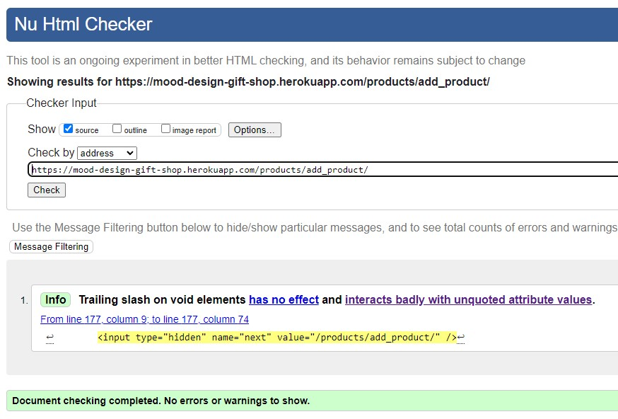
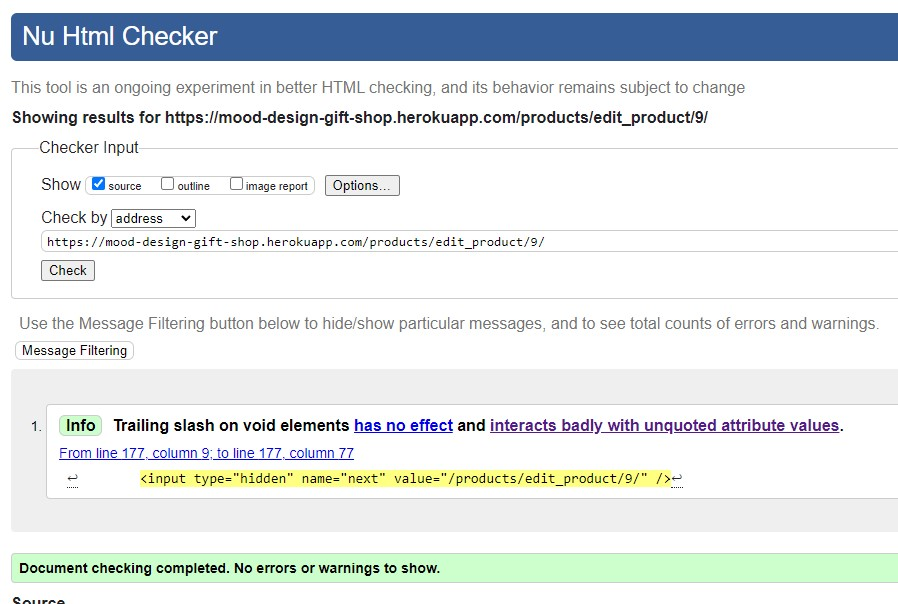
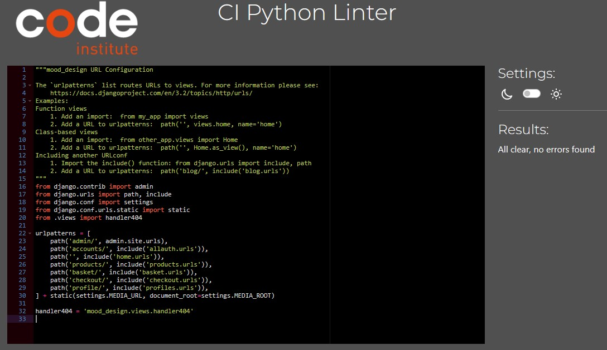

# Testing

##  **Responsiveness**
- The project was responsive tested on https://ui.dev/amiresponsive and it is responsive for every type of devices such as desktop computers, laptops, tablets and smart phones.

## **Code Validator Testing**

- ### **HTML**

    Html code validation tests were made using Nu Html Checker on Google Chrome browser in incognito mode.
    No errors were detected during the tests.

    - Home Page:

        

        Link to the test: https://validator.w3.org/nu/?showsource=yes&doc=https%3A%2F%2Fmood-design-gift-shop.herokuapp.com%2F

    - Shop Page:

        

        Link to the test: https://validator.w3.org/nu/?showsource=yes&doc=https%3A%2F%2Fmood-design-gift-shop.herokuapp.com%2Fproducts%2F

    - Workshop Page:

        

        Link to the test: https://validator.w3.org/nu/?showsource=yes&doc=https%3A%2F%2Fmood-design-gift-shop.herokuapp.com%2Fproducts%2Fworkshop%2F

    - Product Details Page:

        Product on stock details Page.

        

        Link to the test: https://validator.w3.org/nu/?showsource=yes&doc=https%3A%2F%2Fmood-design-gift-shop.herokuapp.com%2Fproducts%2Fproduct%2F9%2F#l148c7

        Out of Stock products details.

        

        Link to the test: https://validator.w3.org/nu/?showsource=yes&doc=https%3A%2F%2Fmood-design-gift-shop.herokuapp.com%2Fproducts%2Fproduct%2F5%2F#l148c7

        No image (default image) Products details Page.

        

        Link to the test: https://validator.w3.org/nu/?showsource=yes&doc=https%3A%2F%2Fmood-design-gift-shop.herokuapp.com%2Fproducts%2Fproduct%2F7%2F#l148c7

    - Add Product Page:
    
        

        Link to the test: https://validator.w3.org/nu/?showsource=yes&doc=https%3A%2F%2Fmood-design-gift-shop.herokuapp.com%2Fproducts%2Fadd_product%2F#l148c7

    - Edit Product Page:
    
        

        Link to the test: 

    - My Profile Page:

        

        Link to the test: 

    - Basket Page:

        

        Link to the test: https://validator.w3.org/nu/?showsource=yes&doc=https%3A%2F%2Fmood-design-gift-shop.herokuapp.com%2Fbasket%2F#l148c7
    
    - Checkout Page:

        

        Link to the test: https://validator.w3.org/nu/?showsource=yes&doc=https%3A%2F%2Fmood-design-gift-shop.herokuapp.com%2Fcheckout%2F#l148c7

    - Checkout Success Page:

        

        Link to the test: https://validator.w3.org/nu/?showsource=yes&doc=https%3A%2F%2Fmood-design-gift-shop.herokuapp.com%2Fcheckout%2Fcheckout_success%2F69A91F635FB5451E8FC3946D7E970A66#l148c7

    - Register Page:

        

        Link to the test: https://validator.w3.org/nu/?showsource=yes&doc=https%3A%2F%2Fmood-design-gift-shop.herokuapp.com%2Faccounts%2Fsignup%2F#l148c7

    - Login Page:

        

        Link to the test: https://validator.w3.org/nu/?showsource=yes&doc=https%3A%2F%2Fmood-design-gift-shop.herokuapp.com%2Faccounts%2Flogin%2F#l148c7

    - Logout Page:

        

        Link to the test: https://validator.w3.org/nu/?showsource=yes&doc=https%3A%2F%2Fmood-design-gift-shop.herokuapp.com%2Faccounts%2Flogout%2F#l148c7

        

    * Link to the validation testing for my Html file:

- ### **CSS**
    * No errors were detected when passing through the [jigsaw.w3 validator](https://jigsaw.w3.org/css-validator). 

         
    

- ### **JAVASCRIPT**
   
    * No errors were detected when passing through the jshint validator.

         

- ### **PYTHON**

     No error detected when passing the following file through the CI Python Linter:

    - mood_design views.py:

        

    - mood_design urls.py:

        

    - home views.py:

        

    - home forms.py:

        

    - home urls.py:

        

    - products views.py:

        

    - products forms.py:

        

    - products urls.py:

        

    - products admin.py:

        

    - profiles views.py:

        

    - profiles forms.py:

        

    - profiles urls.py:

        

    - profiles views.py:

        

    - basket views.py:

        

    - basket context.py:

        

    - checkout views.py:

        

    - checkout forms.py:

        

    - checkout urls.py:

        Add checkout.urls

        

    - checkout admin.py:

        
   