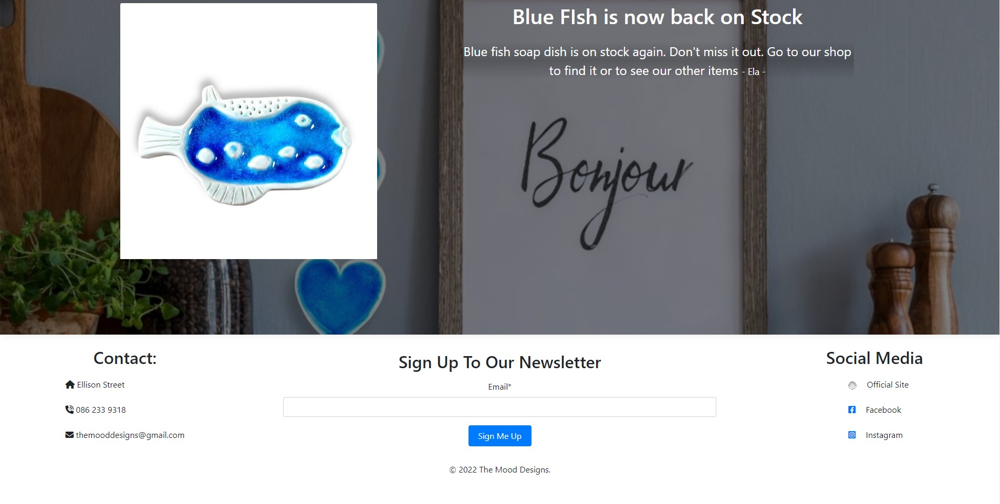
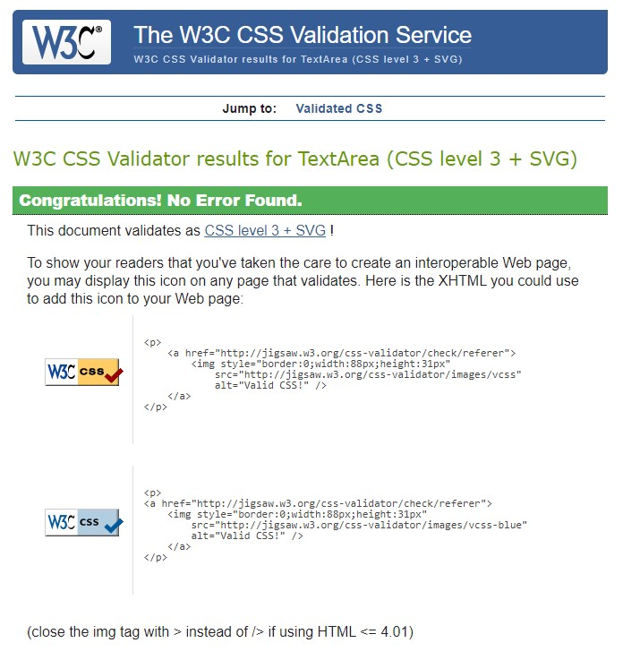
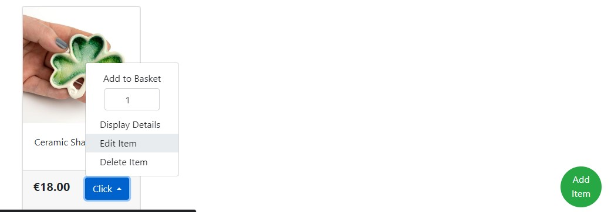

# Testing

##  **Responsiveness**
- The project was responsive tested on https://ui.dev/amiresponsive and it is responsive for every type of devices such as desktop computers, laptops, tablets and smart phones.

 No problem with responsiveness or any sort of visual issues were detected during testing the application on different popular browsers, such Google Chrome, Microsoft Edge, Avast Browser or Netbox Browser.

### Google Chrome:

 

 

### Avast Browser:

 

 

### Microsoft Edge:

 

 

### Netbox Browser:

 

 

### Mobile-size divices

Although the Page is working fine on most of the mobile devices such as tablets and mobile phones. Some visual issues are possible in very small screen sizes and horizontal screen position:

However the issues do not significantly affect the accessibility to application features, **it is recommended to use the vertical screen position on mobile divices.** 

## **Code Validator Testing**

- ### **HTML**

    Html code validation tests were made using Nu Html Checker on Google Chrome browser in incognito mode.
    No errors were detected during the tests.

    - Home Page:

        

        Link to the test: https://validator.w3.org/nu/?showsource=yes&doc=https%3A%2F%2Fmood-design-gift-shop.herokuapp.com%2F

    - Shop Page:

        

        Link to the test: https://validator.w3.org/nu/?showsource=yes&doc=https%3A%2F%2Fmood-design-gift-shop.herokuapp.com%2Fproducts%2F

    - Workshop Page:

        

        Link to the test: https://validator.w3.org/nu/?showsource=yes&doc=https%3A%2F%2Fmood-design-gift-shop.herokuapp.com%2Fproducts%2Fworkshop%2F

    - Product Details Page:

        Product on stock details Page.

        

        Link to the test: https://validator.w3.org/nu/?showsource=yes&doc=https%3A%2F%2Fmood-design-gift-shop.herokuapp.com%2Fproducts%2Fproduct%2F9%2F#l148c7

        Out of Stock products details.

        

        Link to the test: https://validator.w3.org/nu/?showsource=yes&doc=https%3A%2F%2Fmood-design-gift-shop.herokuapp.com%2Fproducts%2Fproduct%2F5%2F#l148c7

        No image (default image) Products details Page.

        

        Link to the test: https://validator.w3.org/nu/?showsource=yes&doc=https%3A%2F%2Fmood-design-gift-shop.herokuapp.com%2Fproducts%2Fproduct%2F7%2F#l148c7

    - Add Product Page:
    
        

        Link to the test: https://validator.w3.org/nu/?showsource=yes&doc=https%3A%2F%2Fmood-design-gift-shop.herokuapp.com%2Fproducts%2Fadd_product%2F#l148c7

    - Edit Product Page:
    
        

        Link to the test: https://validator.w3.org/nu/?showsource=yes&doc=https%3A%2F%2Fmood-design-gift-shop.herokuapp.com%2Fproducts%2Fedit_product%2F9%2F#l148c7

    - My Profile Page:

        

    - Basket Page:

        

        Link to the test: https://validator.w3.org/nu/?showsource=yes&doc=https%3A%2F%2Fmood-design-gift-shop.herokuapp.com%2Fbasket%2F#l148c7
    
    - Checkout Page:

        

        Link to the test: https://validator.w3.org/nu/?showsource=yes&doc=https%3A%2F%2Fmood-design-gift-shop.herokuapp.com%2Fcheckout%2F#l148c7

    - Checkout Success Page:

        

        Link to the test: https://validator.w3.org/nu/?showsource=yes&doc=https%3A%2F%2Fmood-design-gift-shop.herokuapp.com%2Fcheckout%2Fcheckout_success%2F69A91F635FB5451E8FC3946D7E970A66#l148c7

    - Register Page:

        

        Link to the test: https://validator.w3.org/nu/?showsource=yes&doc=https%3A%2F%2Fmood-design-gift-shop.herokuapp.com%2Faccounts%2Fsignup%2F#l148c7

    - Login Page:

        

        Link to the test: https://validator.w3.org/nu/?showsource=yes&doc=https%3A%2F%2Fmood-design-gift-shop.herokuapp.com%2Faccounts%2Flogin%2F#l148c7

    - Logout Page:

        

        Link to the test: https://validator.w3.org/nu/?showsource=yes&doc=https%3A%2F%2Fmood-design-gift-shop.herokuapp.com%2Faccounts%2Flogout%2F#l148c7

        

- ### **CSS**
    * No errors were detected when passing through the [jigsaw.w3 validator](https://jigsaw.w3.org/css-validator). 

    - base.css file

        
    
    - checkout.css file

           
    

- ### **JAVASCRIPT**

   
    * I have used the recommended [JShint Validator](https://jshint.com) to validate all of my JS files.
    No errors were detected when passing through the jshint validator.

        

    * Also a function activating navbar tiles, nested in a JS block of code in the base.html file  doesn't contain any errors:

        

- ### **PYTHON**

     No error detected when passing the following file through the CI Python Linter:

    - mood_design views.py:

        

    - mood_design urls.py:

        

    - home views.py:

        

    - home forms.py:

        

    - home urls.py:

        

    - products views.py:

        

    - products forms.py:

        

    - products urls.py:

        

    - products admin.py:

        

    - profiles views.py:

        

    - profiles forms.py:

        

    - profiles urls.py:

        

    - profiles views.py:

        

    - basket views.py:

        

    - basket context.py:

        

    - checkout views.py:

        

    - checkout forms.py:

        

    - checkout urls.py:

        Add checkout.urls

        

    - checkout admin.py:

        
   

## **Manual Testing**

Testing all the applications functionalities.

### **Add Product**

This function is available only for user registered as admin.
If an user logged in as regular user tries to access this function a warning message is displayed.

If any non-admin user tries to access this function he is redirected to the Sign In Page where he can Log in.

Steps:
* Go to the Shop Page
* Click "Add Item" button
* Fill up all the required fields. 
    
* Add an image of the product otherwise a default image will be added to the product.
    

Expected result:
* A confirmation toast box should be displayed
* A new product (Ceramic Shamrock) should appear on the page
    

Although entering negative values is accepted by the application,

assigning a negative value to the products quantity will result with displaying the product as "Out Of Stock".

The quantity can be changed anytime by the admin user.

### **Edit Product**

This function available only for user registered as admin.
If an user logged in as regular user tries to access this function a warning message is displayed.

If any non-admin user tries to access this function he is redirected to the Sign In Page where he can Log in.

Steps:
* Go to the Shop Page
* Expand the Click menu and choose "Edit Item" option.
    
* Fill up all the required fields. 
    

Expected result:
* A confirmation toast box should be displayed
    
* The products detail should be updated.

Although entering negative values is accepted by the application,

assigning a negative value to the products quantity will result with displaying the product as "Out Of Stock".

The quantity can be changed anytime by the admin user.

### **Deleting Product**

This function available only for user registered as admin.
If an user logged in as regular user tries to access this function a warning message is displayed.

If any non-admin user tries to access this function he is redirected to the Sign In Page where he can Log in.

Steps:
* Go to the Shop Page
* Expand the Click menu and choose "Delete Item" option.
    

Expected result:
* A confirmation toast box should be displayed
* The products should disapear from the Shop Page.
    

### **Register an account**

This function available for every user.

Steps:
* Expand the "Account" tab in the Page Navigation Bar and choose "Register" 
option.
    
* Fill up the form and submit it by clicking "Sign Up" button.
    
  Not entering values in to the required fields results with displaying a warning message.
    

Expected result:
* A info box should display an information that the confirmation email was sent to the user.
    
* An email with the verification link should be posted to the users inbox.
    
    
* Clicking the link should verify the new user and Information box should be displayed.
    
    

### **Login**

This function is available only for registered user.

Steps:
* Expand the "Account" tab in the Page Navigation Bar and choose "Login" option.
* Fill up the form and submit it.
    
  Not entering values in to the required fields results with displaying a warning message.
    

Expected result:
* A confirmation toast box should be displayed
    
* A new option "My Profile" option should be available in the "Account" tab in the navigation bar.
    
* Also the form in the Checkout Page since now should be prefilled.
    

### **Update an account**

This function is available only for logged in users.

Steps:
* Expand the "Account" tab in the Page Navigation Bar and choose "My Profile" option.
    
* Fill up the form and submit it by clicking the "Update Information" button.
    

Expected result:
* A confirmation toast box should be displayed
    
* After refreshing the page the user details should be still displayed.

### **Log out**

This function is available only for logged in users.

Steps:
* Expand the "Account" tab in the Page Navigation Bar and choose "Logout" option.
* Submit you choice by clicking "Sign Out" button.
    

Expected result:
* A confirmation toast box should be displayed
    
* "My Profile" tab should not be accessible in the "Account" tab. And only basic option should be displayed.
    

### **Add product to the shopping basket**

This function is available to all user: loged in as well as not loged in users.
It allows the user to add product to the shopping basket where the products can be updated, deleted from basket or proceded to the chechout.

Steps:
* Go to the shop page or to the workshop page.
* In the shop page expand the "Click" button and choose the quantity then click "Add to Basket" option or choose "Display Details" to see more details about the product.
    
* The product can be added to the basket from the Product Detail Page also.
    

Expected result:
* After clicking "Add to Basket" button the product will be added to the basket and the Basket tab in the Navigation Bar will display the Total Price of the order.
    
* A confirmation toast box should be displayed and the user will be redirected to the Shop Page.
* All the product added to the Shopping Basket will be displayed in the Basket Page.
    

Errors:

In case of entering incorrect values, such as 0 or value greater the the quantity of the products available on stock a suitable warning message will be displayed
    
    

* An error occured when a user is trying to submit an empty value.

    
    
    
This problem was handled programmatically using try/catch block inside the add_to_basket() function in the basket/views.py.
    

### **Update Product in the basket.**

Steps:
* Click the Basket Icon displayed in the Navigation Bar go to the Basket Page.
    
* Enter demanded value in the Quantity column.
* Submit clicking green button.

Expected result:
* A confirmation toast box should be displayed
* Number in the Quantity box should be updated.
* The Total Price of the Order ahould also be updated immediately.
    

In case of entering incorrect values, such as 0 or value greater the the quantity of the products available on stock a suitable warning message will be displayed
    
    

### **Remove Product from the basket**

Steps:
* Click the Basket Icon displayed in the Navigation Bar go to the Basket Page.
    
* Click the red button in the Remove Item column.

Expected result:
* A confirmation toast box should be displayed
* The product should be remnoved from the basket.
* The Total Price of the Order should also be updated immediately.
    

### **Make a payment at the Checkout Page**

Steps:
* Go to the Basket Page. If there are any products added a "Go To Checkout" button should be displayed.
* Click "Go To Checkout" button to go to the Checkout Page and fill up the 
form.
    
* Click "Complete Order" button to submit.

Expected result:
* A confirmation toast box should be displayed.
* Order Summary Page should be displayed.
    
* The Basket should be emptied.
* Products quantity values should have been updated as well.
    
* An orders confirmation email should be sent to the users email address.
    
    
* The order should be added to the Orders History section.
    

### **Sign up to the Newsletter**

Every non-admin user can sign-in to Newsletter by going to the Home Page footer, filling up and submitting the form.

Steps:
* Go to the footer on the Home Page.
    
* Enter your email in the "Sign Up To Our Newsletter" diagram.
    
* Submit the form by clicking "Sign Me Up" button.

Expected result:
* A confirmation toast box should be displayed
    
* A confiramtion email should be sent to the entered email address.
    

In case of entering incorrect value a suitable warning message will be displayed.
    
    

### **Publish a Post**

This function available only for user registered as admin.

Steps:
* Go to the Home Page
* Fill up the form places on the bottom of the page.
    
* Optionally the Post can be sent as Newsletter to chosen emails.
* Submit the form.

Expected result:
* A confirmation toast box should be displayed
* The new Post should appear in the Home Page.
    
* If any email was chosen in the form a Newsletter with the Post is sent to chosen emails.
     
* In case of sending an empty Post or a post that doesn't contain required values a warning message will be displayed.
     

### **Edit Post**

This function is available only for users registered as admin.

Steps:
* Go to the Home Page
    
* Fill up the form places on the bottom of the page.
    
* Submit the form.

Expected result:
* A confirmation toast box should be displayed
    
* The new Post should appear in the Home Page.
    

### **Update products quantity on stock**

After the payment is made the quantity of products available on stock should be immediately updated, which means that the number of units sold in the recent transaction should be subtracted.

Products quantity before making a sale.

Products in the shopping basket.

Products quantity after the sale is finished.

Note. The number of units available on stock is updated after the payment is made. Not after the product is added to the basket.
